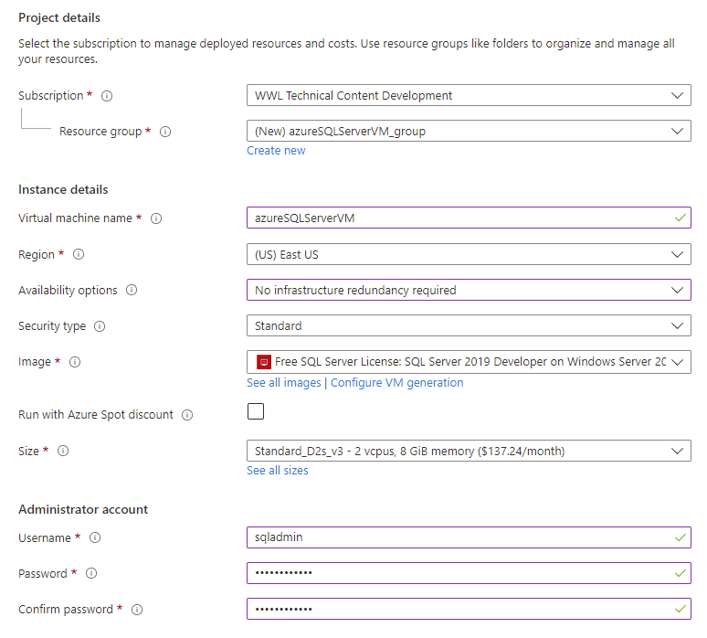
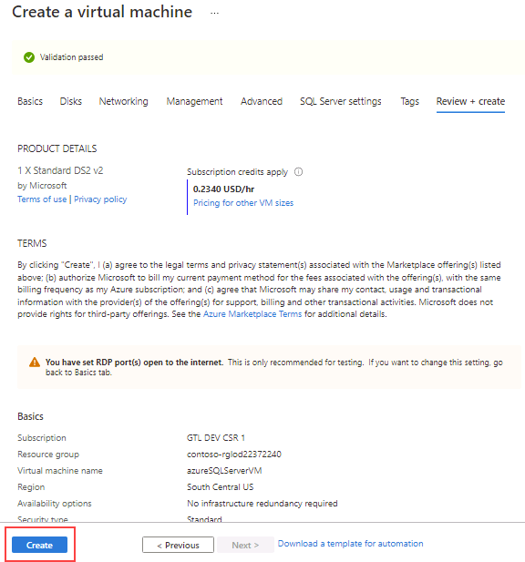
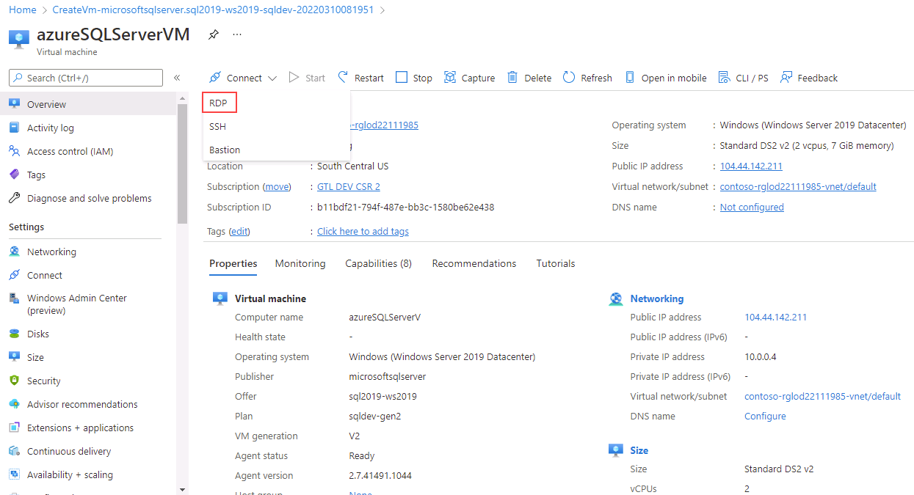

---
lab:
  title: 实验室 1 - 在 Azure 虚拟机上预配 SQL Server
  module: Plan and Implement Data Platform Resources
---

# 在 Azure 虚拟机上预配 SQL Server

预计时间：30 分钟

学生将探索 Azure 门户，并使用它来创建一个安装了SQL Server 2019 的 Azure VM。 然后，他们将通过远程桌面协议连接到虚拟机。

你是 AdventureWorks 的数据库管理员。 你需要创建一个测试环境用于概念证明。 概念证明将在 Azure 虚拟机上使用 SQL Server 和AdventureWorksDW 数据库的备份。 你需要设置虚拟机、还原数据库并对其进行查询以确保其可用。

## 在 Azure 虚拟机上部署 SQL Server

1. 在实验室虚拟机中，启动浏览器会话并导航到 [https://portal.azure.com](https://portal.azure.com/)，然后使用与 Azure 订阅关联的 Microsoft 帐户登录。

    

1. 在页面顶部找到搜索栏。 搜索 Azure SQL。 选择“服务”下的结果中显示的 Azure SQL 的搜索结果 。

    

1. 在 Azure SQL 边栏选项卡中，选择“创建” 。

    

1. 在“选择 SQL 部署选项”边栏选项卡上，单击“SQL 虚拟机”下的下拉框 。 选择标记为“免费 SQL Server 许可证: Windows Server 2022 上的 SQL 2019 Developer”的选项。 然后选择“创建”。

    

1. 在“创建虚拟机”页面上，输入以下信息：

    - 订阅：&lt;你的订阅&gt;
    - 资源组：&lt;你的资源组&gt;
    - 虚拟机名称：azureSQLServerVM
    - 区域：&lt;你的本地区域，与你的资源组的选定区域相同&gt;
    - 可用性选项：无需基础结构冗余
    - 映像：免费 SQL Server 许可证：Windows Server 2022 上的 SQL 2019 Developer - Gen1
    - Azure 现成实例：无（未选中）
    - 大小：标准 D2s_v3（2 个 vCPU，8 GiB 内存）。 可能需要选择“查看所有大小”链接来查看选项
    - 管理员帐户用户名：sqladmin
    - 管理员帐户密码：pwd!DP300lab01（或你自己的符合条件的密码）
    - 选择入站端口：RDP (3389)
    - 是否要使用现有的 Windows Server 许可证?：否（未选中）

    记下用户名和密码以供日后使用。

    

1. 导航到“磁盘”选项卡，然后查看配置。

    

1. 导航到“网络”选项卡，然后查看配置。

    

1. 导航到“管理”选项卡，然后查看配置。

    

    验证“启用 auto_shutdown”是否未选中。

1. 导航到“高级”选项卡，然后查看配置。

    

1. 导航到“SQL Server 设置”选项卡，然后查看配置。

    

    注意：还可在此屏幕上为 SQL Server VM 配置存储。 默认情况下，SQL Server Azure VM 模板创建一个具有读取数据缓存的高级磁盘、一个不具有事务日志缓存的高级磁盘，并为 tempdb 使用本地 SSD（在 Windows上为 D:\）。

1. 选择“查看 + 创建”按钮。 然后选择“创建”。

    

1. 在“部署”边栏选项卡上，等待部署完成。 部署 VM 大约需要 5-10 分钟。 部署完成后，选择“转到资源”。

    注意：部署可能需要几分钟时间才能完成。

    

1. 在虚拟机的概述页面上，浏览此资源的菜单选项，查看可用内容。

    

## 在 Azure 虚拟机上连接到 SQL Server

1. 在虚拟机的概述页面上，选择“连接”按钮，然后选择“RDP”。 

    

1. 在“RDP”选项卡上，选择“下载 RDP 文件”按钮。

    

    注意：如果看到“不满足端口先决条件”错误。  请确保选择链接以添加入站网络安全组规则，并在“端口号”字段中提及目标端口。

    

1. 打开刚刚下载的 RDP 文件。 当出现询问是否要连接的对话框时，选择“连接”。

    

1. 输入在虚拟机预配过程中选择的用户名和密码。 然后选择“确定”。

    

1. 当出现询问你是否要进行连接的“远程桌面连接”对话框时，选择“是” 。

    

1. 选择 Windows 开始按钮，然后键入 SSMS。 从列表中选择“Microsoft SQL Server Management Studio 18”。  

    

1. 当 SSMS 打开时，请注意，“连接到服务器”对话框将使用默认实例名称预填充。 选择“连接”  。

    

Azure 门户提供了强大的工具用于管理虚拟机中托管的 SQL Server。 这些工具包括对自动修补的控制、自动备份和简捷的高可用性设置方式。
