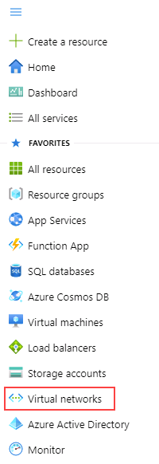
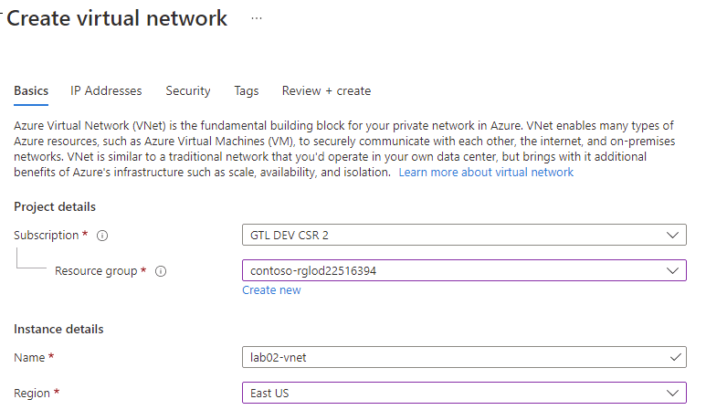
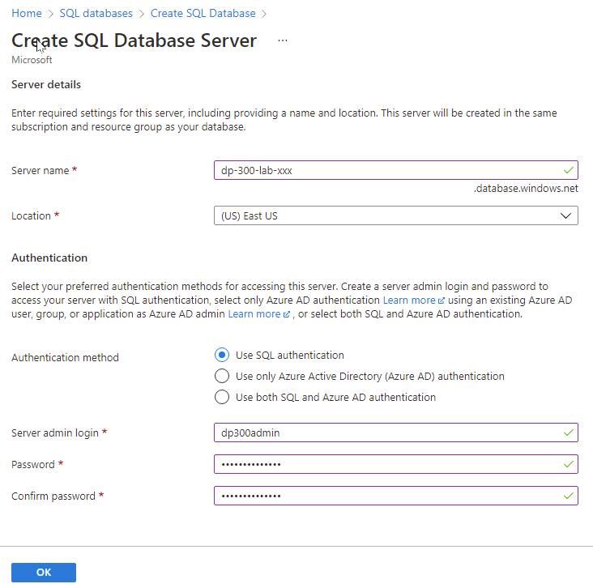
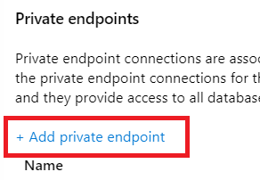
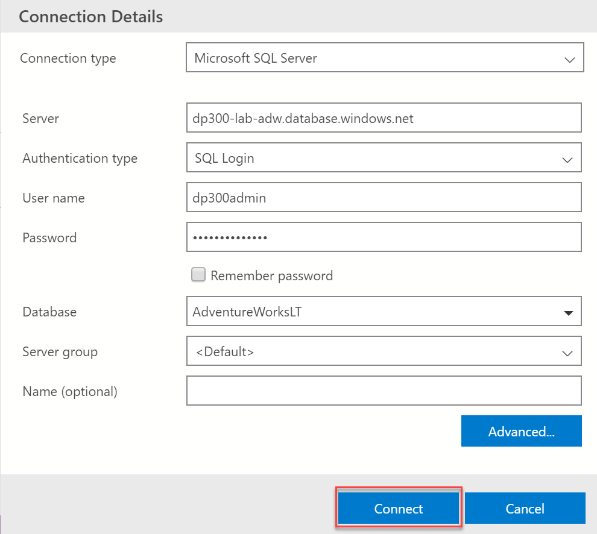
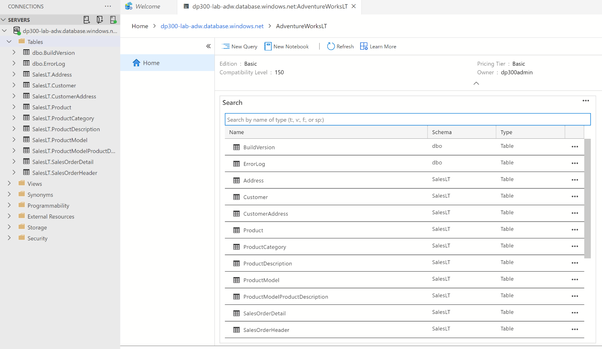
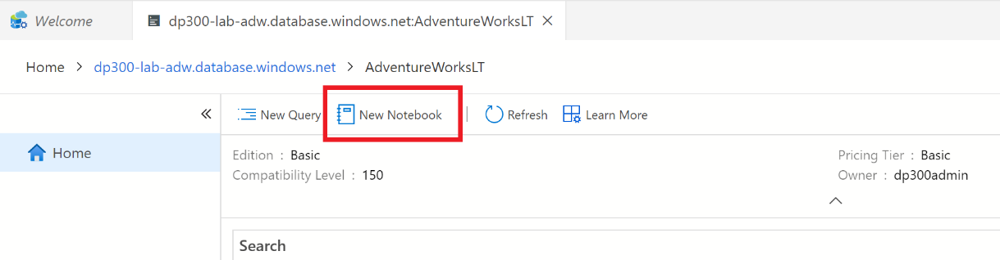
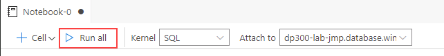

---
lab:
  title: 实验室 2 - 预配 Azure SQL 数据库
  module: Plan and Implement Data Platform Resources
---

# <a name="provision-an-azure-sql-database"></a>预配 Azure SQL 数据库

预计用时：40 分钟

学生将配置部署具有虚拟网络终结点的 Azure SQL 数据库所需的基本资源。 将使用实验室 VM 中的 Azure Data Studio 验证到 SQL 数据库的连接。

作为 AdventureWorks 的数据库管理员，你将建立一个新的 SQL 数据库，其中包括一个虚拟网络终结点，以增加和简化部署的安全性。 将使用 Azure Data Studio 评估 SQL Notebook 在数据查询和结果保留方面的使用。

## <a name="navigate-on-azure-portal"></a>在 Azure 门户上导航

1. 在实验室虚拟机中，启动浏览器会话并导航到 [https://portal.azure.com](https://portal.azure.com/)。 使用此实验室虚拟机的“资源”选项卡上提供的 Azure 用户名和密码连接到门户。  

    

1. 在 Azure 门户顶部的搜索框中搜索“资源组”，然后从选项列表中选择“资源组”。

    

1. 在“资源组”页上，检查列出的资源组（它应以 contoso-rg 开头），记下分配给资源组的位置，因为将在下一个练习中用到它。

    注意：可能分配了不同的位置。

    

## <a name="create-a-virtual-network"></a>创建虚拟网络

1. 在 Azure 门户主页中，选择左侧菜单。  

    

1. 在左侧导航窗格中，单击“虚拟网络”。  

    

1. 单击“+ 创建”打开“创建虚拟网络”页面 。 在“基本信息”选项卡上，完成以下信息：

    - 订阅：&lt;你的订阅&gt;
    - 资源组：以 contoso-rg 开头
    - 名称：lab02-vnet
    - 区域：选择你创建了资源组的同一区域

    

1. 单击“下一页: IP 地址”。  

    

1. 为 Azure SQL 数据库终结点配置虚拟网络的 IP 范围，如下所示：

    - 在“IP 地址”选项卡上，保留 IPv4 地址的默认值。
    - 单击“default”子网链接。 请注意，你看到的子网地址范围可能不同。

        

    - 在右侧的“编辑子网”窗格中，展开“服务”下拉列表，然后选择“Microsoft.Sql”  。 选择“保存” 。
    - 单击“查看 + 创建”按钮，查看新虚拟网络的设置，然后单击“创建” 。

## <a name="provision-an-azure-sql-database"></a>预配 Azure SQL 数据库

1. 在 Azure 门户顶部的搜索框中搜索“SQL 数据库”，然后从选项列表中单击“SQL 数据库”。

    

1. 在“SQL 数据库”边栏选项卡上，选择“+ 创建” 。

    

1. 在“创建 SQL 数据库”页，选择“基本信息”选项卡上的以下选项，然后单击“下一步: 网络”。  

    - 订阅：&lt;你的订阅&gt;
    - 资源组：以 contoso-rg 开头
    - 数据库名称：AdventureWorksLT
    - 服务器：单击“新建”链接。  此时将打开“创建 SQL 数据库服务器”页面。 提供服务器详细信息，如下所示：
        - 服务器名称：dp300-lab-&lt;你的姓名首字母缩写(小写)&gt;（服务器名称必须是全局唯一的）
        - 区域：&lt;你的本地区域，与你的资源组的选定区域相同，否则可能会失败&gt;
        - 身份验证方法：使用 SQL 身份验证
        - 服务器管理员登录名：dp300admin
        - 密码：dp300P@ssword！
        - 确认密码：dp300P@ssword！

        “创建 SQL 数据库服务器”页面应如下所示。 然后单击“确定”。

        

    -  返回到“创建 SQL 数据库”页，确保“想要使用弹性池?”设置为“否”。  
    -  在“计算 + 存储”选项上，单击“配置数据库”链接 。 在“配置”页上的“服务层”下拉列表中，选择“基本”，然后选择“应用”   。

    注意：记下此服务器名称和你的登录信息。 你将在后续实验室中使用此信息。

1. 对于“备份存储冗余”选项，请保留默认值：“异地冗余备份存储”。 

1. 然后，单击“下一步: 网络”。

1. 在“网络”选项卡上的“网络连接”选项中，单击“专用终结点”单选按钮  。

    

1. 然后单击“专用终结点”选项下的“+ 添加专用终结点”链接 。

    

1. 完成右侧窗格的“创建专用终结点”，如下所示：

    - 订阅：&lt;你的订阅&gt;
    - 资源组：以 contoso-rg 开头
    - 区域：&lt;你的本地区域，与你的资源组的选定区域相同，否则可能会失败&gt;
    - 名称：DP-300-SQL-Endpoint
    - 目标子资源：SqlServer
    - 虚拟网络：lab02-vnet
    - 子网：lab02-vnet/default (10.x.0.0/24)
    - 与专用 DNS 区域集成：是
    - 专用 DNS 区域：保留默认值
    - 查看设置，然后单击“确定”  

    

1. 新终结点将显示在“专用终结点”列表中。

    

1. 依次单击“下一步: 安全性”和“下一步: 其他设置”。   

1. 在“其他设置”页上，选择“使用现有数据”选项上的“示例”  。 如果为示例数据库显示弹出消息，请选择“确定”。

    

1. 单击“查看 + 创建”。

1. 查看设置，然后单击“创建”。

1. 部署完成后，单击“转到资源”。

## <a name="enable-access-to-an-azure-sql-database"></a>启用对 Azure SQL 数据库的访问

1. 在“SQL 数据库”页中，选择“概述”部分，然后在顶部选择服务器名称的链接 ：

    

1. 在 SQL Server 导航边栏选项卡上，选择“安全性”部分下的“网络” 。

    

1. 在“公共访问”选项卡上，选择“所选网络”，然后选中“允许 Azure 服务和资源访问此服务器”属性  。 单击“保存” 。

    

## <a name="connect-to-an-azure-sql-database-in-azure-data-studio"></a>连接到 Azure Data Studio 中的 Azure SQL 数据库

1. 从实验室虚拟机启动 Azure Data Studio。

    - 你可能会在 Azure Data Studio 的首次启动时看到此弹出窗口。 如果看到它，请单击“是”（建议）  

        

1. Azure Data Studio 打开后，单击左上角的“连接”按钮，然后单击“添加连接” 。

    

1. 在“连接”边栏中的“连接详细信息”部分填写连接信息，以连接到之前创建的 SQL 数据库。 

    - 连接类型：Microsoft SQL Server
    - 服务器：输入之前创建的 SQL Server 的名称。 例如：dp300-lab-xxxxxxxx.database.windows.net（其中“xxxxxxxx”是随机数字）
    - 身份验证类型：SQL 登录名
    - 用户名：dp300admin
    - Password：dp300P@ssword!
    - 展开“数据库”下拉列表，选择“AdventureWorksLT”。 
        - **注意：** 可能会要求添加防火墙规则，以允许你的客户端 IP 访问此服务器。 如果系统要求你添加防火墙规则，请单击“添加帐户”，然后登录到 Azure 帐户。 在“创建新防火墙规则”屏幕中单击“确定” 。

        

        或者，可在 Azure 门户上为 SQL Server 手动创建防火墙规则，方法是导航到 SQL Server，选择“网络”，然后选择“+ 添加客户端 IPv4 地址”（IP 地址） 

        

    返回连接侧边栏，继续填写连接详细信息：  

    - 服务器组将保留 &lt;默认值&gt;
    - 如果需要，可以使用名称（可选）填充数据库的易记名称
    - 查看设置，然后单击“连接”  

    

1. Azure Data Studio 将连接到数据库，并显示有关数据库的一些基本信息，以及对象列表的一部分。

    

## <a name="query-an-azure-sql-database-with-a-sql-notebook"></a>使用 SQL Notebook 查询 Azure SQL 数据库

1. 在连接到该实验室的 AdventureWorksLT 数据库的 Azure Data Studio 中，单击“新建笔记本”按钮。

    

1. 单击“+ 文本”链接，在笔记本中添加新的文本框  

    

**注意：** 在笔记本中，你可以嵌入纯文本来解释查询或结果集。

1. 输入“按订单小计的前十大客户”文本，根据需要将其设为粗体。

    

1. 单击“+ 单元格”按钮，然后单击“代码单元格”，在笔记本末尾添加新的代码单元格 。  

    

5. 将以下 SQL 语句粘贴到新的单元格中：

```sql
SELECT TOP 10 cust.[CustomerID], 
    cust.[CompanyName], 
    SUM(sohead.[SubTotal]) as OverallOrderSubTotal
FROM [SalesLT].[Customer] cust
    INNER JOIN [SalesLT].[SalesOrderHeader] sohead
         ON sohead.[CustomerID] = cust.[CustomerID]
GROUP BY cust.[CustomerID], cust.[CompanyName]
ORDER BY [OverallOrderSubTotal] DESC
   ```

1. 单击带有箭头的蓝色圆圈执行查询。 请注意查询结果在单元格中的包含方式。

1. 单击“+ 文本”按钮添加新文本单元格。

1. 输入“十大订购产品类别”文本，根据需要将其设为粗体。

1. 再次单击“+ 代码”按钮添加一个新的单元格，并将以下 SQL 语句粘贴到该单元格中：

```sql
SELECT TOP 10 cat.[Name] AS ProductCategory, 
    SUM(detail.[OrderQty]) AS OrderedQuantity
FROM salesLT.[ProductCategory] cat
   INNER JOIN [SalesLT].[Product] prod
      ON prod.[ProductCategoryID] = cat.[ProductCategoryID]
   INNER JOIN [SalesLT].[SalesOrderDetail] detail
      ON detail.[ProductID] = prod.[ProductID]
GROUP BY cat.[name]
ORDER BY [OrderedQuantity] DESC
```

1. 单击带有箭头的蓝色圆圈执行查询。

1. 若要运行笔记本中的所有单元格并显示结果，请单击工具栏中的“全部运行”按钮。

    

1. 在 Azure Data Studio 中，将笔记本从“文件”菜单（“保存”或“另存为”）保存到 C:\Labfiles\Deploy Azure SQL Database 路径（如果文件夹结构不存在，请进行创建）。 确保文件扩展名为 .ipynb

1. 从 Azure Data Studio 内部关闭笔记本的选项卡。 从“文件菜单”中，选择“打开文件”，然后打开刚刚保存的笔记本。 观察查询结果与笔记本中的查询一起保存。

在本练习中，你了解了如何使用虚拟网络终结点部署 Azure SQL 数据库。 你还成功地连接到使用 SQL Server Management Studio 创建的 SQL 数据库。
