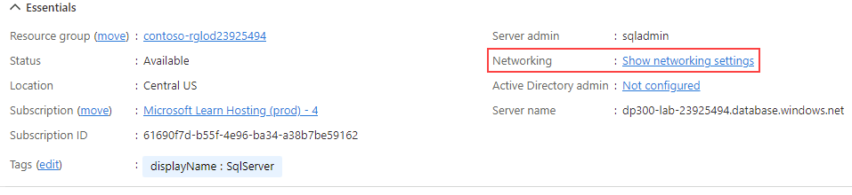
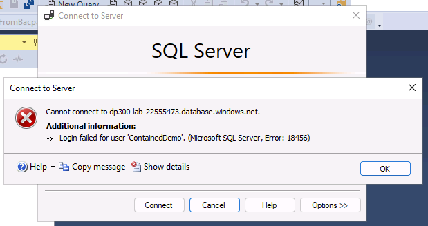
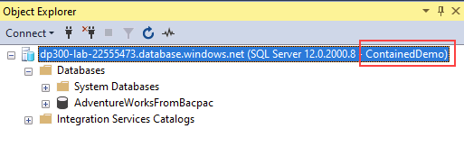

---
lab:
  title: 实验室 4 - 配置 Azure SQL 数据库防火墙规则
  module: Implement a Secure Environment for a Database Service
---

# <a name="implement-a-secure-environment"></a>实现安全环境

预计时间：30 分钟

学生将利用从课程中获取的信息，在 Azure 门户和 AdventureWorks 数据库中进行配置，随后实现安全性。

你已被聘为高级数据库管理员，帮助确保数据库环境的安全。 这些任务侧重于 Azure SQL 数据库。

注意：这些练习要求你复制并粘贴 T-SQL 代码。 在执行代码之前，请验证代码是否已正确复制。

## <a name="configure-azure-sql-database-firewall-rules"></a>配置 Azure SQL 数据库防火墙规则

1. 在实验室虚拟机中，启动浏览器会话并导航到 [https://portal.azure.com](https://portal.azure.com/)。 使用此实验室虚拟机的“资源”选项卡上提供的 Azure 用户名和密码连接到门户。  

    

1. 在 Azure 门户顶部的搜索框中搜索“SQL Server”，然后从选项列表中单击“SQL Server”。

    

1. 选择要转到详细信息页的服务器名称 dp300-lab-XXXXXXXX（可能为 SQL Server 分配了不同的资源组和位置）。

    

1. 在 SQL Server 的详细信息屏幕中，将鼠标移到服务器名称右侧，然后选择“复制到剪贴板”按钮，如下所示。

    

1. 选择“显示网络设置”。

    

1. 在“网络”页上，单击“+ 添加客户端 IPv4 地址(IP 地址)”，然后单击“保存”。  

    

    注意：已为你自动输入客户端 IP 地址。 通过将客户端 IP 地址添加到列表，可使用 SQL Server Management Studio 或其他任何客户端工具连接到 Azure SQL 数据库。 **记下你的客户端 IP 地址，稍后将会用到它。**

1. 打开 SQL Server Management Studio。 在“连接到服务器”对话框中，粘贴 Azure SQL 数据库服务器的名称，然后使用以下凭据登录：

    - 服务器名称：&lt;在此处粘贴你的 Azure SQL 数据库服务器名称&gt;
    - 身份验证：SQL Server 身份验证
    - 服务器管理员登录名：sqladmin
    - 密码：P@ssw0rd01

    

1. 单击“连接”  。

1. 在对象资源管理器中，展开服务器节点，然后右键单击“数据库”。 单击“导入数据层应用程序”。

    

1. 在“导入数据层应用程序”对话框中，单击第一个屏幕上的“下一步”。 

1. 将 https://github.com/MicrosoftLearning/dp-300-database-administrator/blob/master/Instructions/Templates/AdventureWorksLT.bacpac 中的 .bacpac 文件下载到实验室 VM 上的 C:\LabFiles\Secure Environment 路径（如果文件夹结构不存在，请进行创建）。 

1. 在“导入设置”屏幕中，单击“浏览”并导航至 C:\LabFiles\Secure Environment 文件夹，单击 AdventureWorksLT.bacpac 文件，然后单击“打开”    。 返回到“导入数据层应用程序”屏幕，单击“下一步” 。

    

    

1. 在“数据库设置”屏幕上，进行如下更改：

    - 数据库名称：AdventureWorksFromBacpac
    - Microsoft Azure SQL 数据库的版本：基本

    

1. 单击“下一步”。

1. 在“摘要”屏幕中，单击“完成” 。 导入完成后，你将看到以下结果。 然后单击 **“关闭”**。

    

1. 返回到 SQL Server Management Studio，在对象资源管理器中，展开“数据库”文件夹。  然后右键单击 AdventureWorksFromBacpac 数据库，再单击“新建查询”。 

    

1. 通过将文本粘贴到查询窗口中来执行以下 T-SQL 查询。
    1. 重要提示：请将 000.000.000.00 替换为你的客户端 IP 地址。  单击“执行”或按 F5 。

    ```sql
    EXECUTE sp_set_database_firewall_rule 
            @name = N'AWFirewallRule',
            @start_ip_address = '000.000.000.00', 
            @end_ip_address = '000.000.000.00'
    ```

1. 接下来，将在 AdventureWorksFromBacpac 数据库中创建一个包含的用户。 单击“新建查询”，然后执行以下 T-SQL。

    ```sql
    USE [AdventureWorksFromBacpac]
    GO
    CREATE USER ContainedDemo WITH PASSWORD = 'P@ssw0rd01'
    ```

    

    注意：此命令会在 AdventureWorksFromBacpac 数据库中创建一个包含的用户。  我们将在下一步中测试此凭据。

1. 导航到对象资源管理器。 依次单击“连接”和“数据库引擎”。 

    

1. 使用你在之前步骤中创建的凭据尝试连接。 你将需要使用以下信息：

    - 登录名：ContainedDemo
    - 密码：P@ssw0rd01

     单击“连接” 。

     你会收到以下错误。

    

    注意：生成此错误是因为该连接尝试登录 master 数据库，而不是创建用户的 AdventureWorksFromBacpac。 若要更改连接上下文，请单击“确定”来退出错误消息，然后单击“连接到服务器”对话框中的“选项 >>”，如下所示。  

    

1. 在“连接属性”选项卡上，键入数据库名称 AdventureWorksFromBacpac，然后单击“连接”  。

    

1. 请注意，你能够使用 ContainedDemo 用户成功进行身份验证。 这次，你直接登录到 AdventureWorksFromBacpac，它是新创建的用户有权访问的唯一数据库。

    

在本练习中，你已将服务器和数据库防火墙规则配置为访问在 Azure SQL 数据库上托管的数据库。 你还使用 T-SQL 语句创建了一个包含的用户，还使用 SQL Server Management Studio 检查了访问权限。
