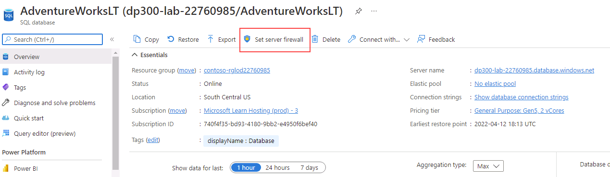
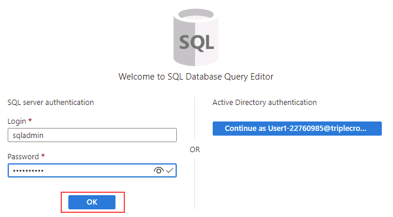
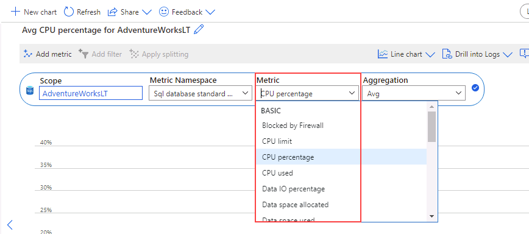

---
lab:
  title: 实验室 6 - 通过监视隔离性能问题
  module: Monitor and optimize operational resources in Azure SQL
---

# 通过监视隔离性能问题

预计时间：30 分钟

学生将获取从课程中获得的信息，以确定 AdventureWorks 中数字转换项目的可交付成果。 通过检查 Azure 门户以及其他工具，学生将确定如何利用工具来识别和解决与性能相关的问题。

你是数据库管理员，需识别与性能相关的问题并提供可行的解决方案来解决发现的所有问题。 需要通过 Azure 门户来识别性能问题并提出解决问题的方法。

**注意：** 这些练习要求你复制并粘贴 T-SQL 代码并利用现有的 SQL 资源。 在执行代码之前，请验证代码是否已正确复制。

## 在 Azure 门户中查看 CPU 利用率

1. 在实验室虚拟机中，启动浏览器会话并导航到 [https://portal.azure.com](https://portal.azure.com/)。 使用此实验室虚拟机的“资源”选项卡上提供的 Azure 用户名和密码连接到门户。

    

1. 在 Azure 门户顶部的搜索框中搜索“SQL Server”，然后从选项列表中单击“SQL Server”。

    

1. 选择要转到详细信息页的服务器名称 dp300-lab-XXXXXXXX（可能为 SQL Server 分配了不同的资源组和位置）。

    

1. 在 Azure SQL Server 的主边栏选项卡中，导航到“设置”部分，选择“SQL 数据库”，然后选择数据库名称 。

    

1. 在数据库主页上，选择“设置服务器防火墙”。

    

1. 在“网络”页上，选择“+ 添加客户端 IPv4 地址(IP 地址)”，然后选择“保存”。

    

1. 在“网络”上方的导航中，选择以 AdventureWorks 开头的链接 。

    

1. 在左侧导航栏中，选择“查询编辑器(预览版)”。

    

    注意：此功能为预览版。

1. 在“密码”中，键入 P@ssw0rd01，然后选择“确定”  。

    

1. 在“查询 1”中，键入以下查询，然后选择“运行” ：

    ```sql
    DECLARE @Counter INT 
    SET @Counter=1
    WHILE ( @Counter <= 10000)
    BEGIN
        SELECT 
             RTRIM(a.Firstname) + ' ' + RTRIM(a.LastName)
            , b.AddressLine1
            , b.AddressLine2
            , RTRIM(b.City) + ', ' + RTRIM(b.StateProvince) + '  ' + RTRIM(b.PostalCode)
            , CountryRegion
            FROM SalesLT.Customer a
            INNER JOIN SalesLT.CustomerAddress c 
                ON a.CustomerID = c.CustomerID
            RIGHT OUTER JOIN SalesLT.Address b
                ON b.AddressID = c.AddressID
        ORDER BY a.LastName ASC
        SET @Counter  = @Counter  + 1
    END
    ```

    

1. 等待查询完成。

1. 在 AdventureWorksLT 数据库的边栏选项卡上，选择“监视”部分的“指标”图标  。

    

1. 更改“指标”菜单选项以反映 CPU 百分比，然后选择“平均值聚合”。这将显示给定时间范围的平均 CPU 百分比。

    

1. 观察一段时间内的 CPU 平均值。 结果可能略有不同。 或者，可多次运行查询以获得更实质性的结果。

    

## 识别 CPU 占用率高的查询

1. 在 AdventureWorks 数据库的边栏选项卡的“智能性能”部分，找到“Query Performance Insight”图标  。

    

1. 选择“重置设置”。

    

1. 单击图下方的网格中的查询。 如果未显示查询，请等待 2 分钟，然后选择“刷新”。

    注意：你可能具有不同的持续时间和查询 ID。 如果看到多个查询，请单击每个查询以观察结果。

    

对于此查询，你可以看到总持续时间超过一分钟，运行了大约 10,000 次。

在本练习中，你学习了如何探索 Azure SQL 数据库的服务器资源，以及如何通过 Query Performance Insight 识别潜在的查询性能问题。
