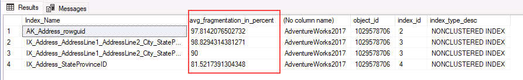

---
lab:
  title: 实验室 7 - 检测并纠正碎片问题
  module: Monitor and optimize operational resources in Azure SQL
---

# <a name="detect-and-correct-fragmentation-issues"></a>检测并纠正碎片问题

预计用时：15 分钟

学生将获取从课程中获得的信息，以确定 AdventureWorks 中数字转换项目的可交付成果。 通过检查 Azure 门户以及其他工具，学生将确定如何利用本机工具来识别和解决与性能相关的问题。 最后，学生将能够识别数据库中的碎片，并学习恰当解决问题的步骤。

你是数据库管理员，需识别与性能相关的问题并提供可行的解决方案来解决发现的所有问题。 十多年来，AdventureWorks 一直将自行车和自行车零件直接销售给最终用户和分销商。 最近，该公司注意到其用于满足客户要求的产品性能下降了。 你需要使用 SQL 工具来确定性能问题并提出解决这些问题的方法。

注意：这些练习要求你复制并粘贴 T-SQL 代码。 在执行代码之前，请验证代码是否已正确复制。

## <a name="restore-a-database"></a>还原数据库

1. 将 https://github.com/MicrosoftLearning/dp-300-database-administrator/blob/master/Instructions/Templates/AdventureWorks2017.bak 中的数据库备份文件下载到实验室虚拟机上的 C:\LabFiles\Monitor and optimize 路径（如果文件夹结构不存在，请进行创建）。 

    

1. 选择 Windows 开始按钮，然后键入 SSMS。 从列表中选择“Microsoft SQL Server Management Studio 18”。  

    

1. 当 SSMS 打开时，请注意，“连接到服务器”对话框将使用默认实例名称预填充。 选择“连接”  。

    

1. 选择“数据库”文件夹，然后选择“新建查询” 。

    

1. 在“新建查询”窗口中，将以下 T-SQL 复制并粘贴到其中。 执行查询以还原数据库。

    ```sql
    RESTORE DATABASE AdventureWorks2017
    FROM DISK = 'C:\LabFiles\Monitor and optimize\AdventureWorks2017.bak'
    WITH RECOVERY,
          MOVE 'AdventureWorks2017' 
            TO 'C:\LabFiles\Monitor and optimize\AdventureWorks2017.mdf',
          MOVE 'AdventureWorks2017_log'
            TO 'C:\LabFiles\Monitor and optimize\AdventureWorks2017_log.ldf';
    ```

    注意：数据库备份文件名和路径应与在步骤 1 中下载的内容匹配，否则命令将失败。

1. 还原完成后，应会看到一条成功消息。

    

## <a name="investigate-index-fragmentation"></a>调查索引碎片

1. 选择“新建查询”  。 复制下面的 T-SQL 代码并将其粘贴到“查询”窗口中。 选择“执行”以执行此查询。

    ```sql
    USE AdventureWorks2017
    GO
    
    SELECT i.name Index_Name
     , avg_fragmentation_in_percent
     , db_name(database_id)
     , i.object_id
     , i.index_id
     , index_type_desc
    FROM sys.dm_db_index_physical_stats(db_id('AdventureWorks2017'),object_id('person.address'),NULL,NULL,'DETAILED') ps
     INNER JOIN sys.indexes i ON ps.object_id = i.object_id 
     AND ps.index_id = i.index_id
    WHERE avg_fragmentation_in_percent > 50 -- find indexes where fragmentation is greater than 50%
    ```

    此查询将报告碎片率超过 50% 的任何索引。 查询不应返回任何结果。

1. 选择“新建查询”  。 复制下面的 T-SQL 代码并将其粘贴到“查询”窗口中。 选择“执行”以执行此查询。

    ```sql
    USE AdventureWorks2017
    GO
        
    INSERT INTO [Person].[Address]
        ([AddressLine1]
        ,[AddressLine2]
        ,[City]
        ,[StateProvinceID]
        ,[PostalCode]
        ,[SpatialLocation]
        ,[rowguid]
        ,[ModifiedDate])
        
    SELECT AddressLine1,
        AddressLine2, 
        'Amsterdam',
        StateProvinceID, 
        PostalCode, 
        SpatialLocation, 
        newid(), 
        getdate()
    FROM Person.Address;
    
    GO
    ```

    此查询会通过添加大量新记录来提高 Person.Address 表及其索引的碎片等级。

1. 再次执行第一个查询。 现在，你应该能够看到 4 个碎片程度高的索引。

    

1. 复制下面的 T-SQL 代码并将其粘贴到“查询”窗口中。 选择“执行”以执行此查询。

    ```sql
    SET STATISTICS IO,TIME ON
    GO
        
    USE AdventureWorks2017
    GO
        
    SELECT DISTINCT (StateProvinceID)
        ,count(StateProvinceID) AS CustomerCount
    FROM person.Address
    GROUP BY StateProvinceID
    ORDER BY count(StateProvinceID) DESC;
        
    GO
    ```

    单击 SQL Server Management Studio 的“结果”窗格中的“消息”选项卡。 记下查询执行的逻辑读取次数。

    

## <a name="rebuild-fragmented-indexes"></a>重新生成碎片索引

1. 复制下面的 T-SQL 代码并将其粘贴到“查询”窗口中。 选择“执行”以执行此查询。

    ```sql
    USE AdventureWorks2017
    GO
    
    ALTER INDEX [IX_Address_StateProvinceID] ON [Person].[Address] REBUILD PARTITION = ALL 
    WITH (PAD_INDEX = OFF, 
        STATISTICS_NORECOMPUTE = OFF, 
        SORT_IN_TEMPDB = OFF, 
        IGNORE_DUP_KEY = OFF, 
        ONLINE = OFF, 
        ALLOW_ROW_LOCKS = ON, 
        ALLOW_PAGE_LOCKS = ON)
    ```

1. 执行以下查询以确认 IX_Address_StateProvinceID 索引的碎片化不再超过 50%。

    ```sql
    USE AdventureWorks2017
    GO
        
    SELECT DISTINCT i.name Index_Name
        , avg_fragmentation_in_percent
        , db_name(database_id)
        , i.object_id
        , i.index_id
        , index_type_desc
    FROM sys.dm_db_index_physical_stats(db_id('AdventureWorks2017'),object_id('person.address'),NULL,NULL,'DETAILED') ps
        INNER JOIN sys.indexes i ON (ps.object_id = i.object_id AND ps.index_id = i.index_id)
    WHERE i.name = 'IX_Address_StateProvinceID'
    ```

    比较结果，我们可以看到碎片率从 81% 下降到了 0。

1. 重新执行上一部分中的 select 语句。 记下 Management Studio 中“结果”窗格的“消息”选项卡中的逻辑读取次数。 重新生成索引之前遇到的逻辑读取次数是否有变化？

    ```sql
    SET STATISTICS IO,TIME ON
    GO
        
    USE AdventureWorks2017
    GO
        
    SELECT DISTINCT (StateProvinceID)
        ,count(StateProvinceID) AS CustomerCount
    FROM person.Address
    GROUP BY StateProvinceID
    ORDER BY count(StateProvinceID) DESC;
        
    GO
    ```

由于索引已重新生成，所以它现在会尽可能高效，并且逻辑读取次数应该会减少。 现在，你已了解到索引维护可能会影响查询性能。

在本练习中，你学习了如何重新生成索引和分析逻辑读取来提高查询性能。
