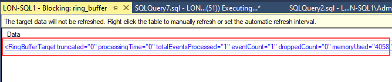
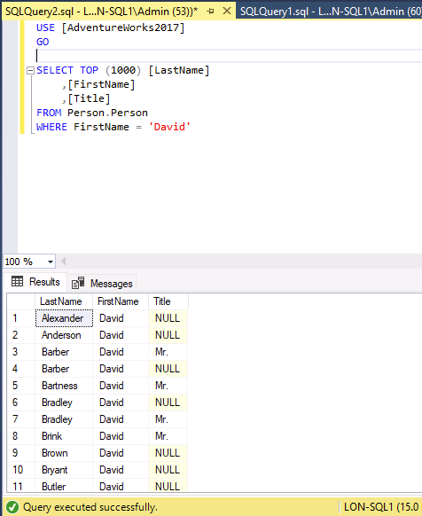
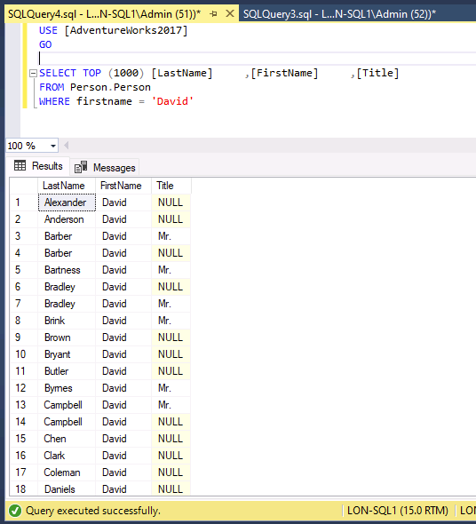

---
lab:
  title: 实验室 8 - 识别并解决阻塞性问题
  module: Optimize query performance in Azure SQL
---

# 识别并解决阻塞性问题

预计用时：15 分钟

学生将获取从课程中获得的信息，以确定 AdventureWorks 中数字转换项目的可交付成果。 通过检查 Azure 门户以及其他工具，学生将确定如何利用本机工具来识别和解决与性能相关的问题。 最后，学生将能够正确地识别和解决阻塞性问题。

你是数据库管理员，需识别与性能相关的问题并提供可行的解决方案来解决发现的所有问题。 你需要调查性能问题并提出解决这些问题的方法。

注意：这些练习要求你复制并粘贴 T-SQL 代码。 在执行代码之前，请验证代码是否已正确复制。

## 还原数据库

1. 将 https://github.com/MicrosoftLearning/dp-300-database-administrator/blob/master/Instructions/Templates/AdventureWorks2017.bak 中的数据库备份文件下载到实验室虚拟机上的 C:\LabFiles\Monitor and optimize 路径（如果文件夹结构不存在，请进行创建）。

    

1. 选择 Windows 开始按钮，然后键入 SSMS。 从列表中选择“Microsoft SQL Server Management Studio 18”。  

    

1. 当 SSMS 打开时，请注意，“连接到服务器”对话框将使用默认实例名称预填充。 选择“连接”  。

    

1. 选择“数据库”文件夹，然后选择“新建查询” 。

    

1. 在“新建查询”窗口中，将以下 T-SQL 复制并粘贴到其中。 执行查询以还原数据库。

    ```sql
    RESTORE DATABASE AdventureWorks2017
    FROM DISK = 'C:\LabFiles\Monitor and optimize\AdventureWorks2017.bak'
    WITH RECOVERY,
          MOVE 'AdventureWorks2017' 
            TO 'C:\LabFiles\Monitor and optimize\AdventureWorks2017.mdf',
          MOVE 'AdventureWorks2017_log'
            TO 'C:\LabFiles\Monitor and optimize\AdventureWorks2017_log.ldf';
    ```

    注意：数据库备份文件名和路径应与在步骤 1 中下载的内容匹配，否则命令将失败。

1. 还原完成后，应会看到一条成功消息。

    

## 运行已阻止的查询报告

1. 选择“新建查询”  。 复制下面的 T-SQL 代码并将其粘贴到“查询”窗口中。 选择“执行”以执行查询。

    ```sql
    USE MASTER

    GO

    CREATE EVENT SESSION [Blocking] ON SERVER 
    ADD EVENT sqlserver.blocked_process_report(
    ACTION(sqlserver.client_app_name,sqlserver.client_hostname,sqlserver.database_id,sqlserver.database_name,sqlserver.nt_username,sqlserver.session_id,sqlserver.sql_text,sqlserver.username))
    ADD TARGET package0.ring_buffer
    WITH (MAX_MEMORY=4096 KB, EVENT_RETENTION_MODE=ALLOW_SINGLE_EVENT_LOSS, MAX_DISPATCH_LATENCY=30 SECONDS, MAX_EVENT_SIZE=0 KB,MEMORY_PARTITION_MODE=NONE, TRACK_CAUSALITY=OFF,STARTUP_STATE=ON)
    GO

    -- Start the event session 
    ALTER EVENT SESSION [Blocking] ON SERVER 
    STATE = start; 
    GO
    ```

    上述 T-SQL 代码将创建一个将捕获阻止事件的扩展事件会话。 数据将包含以下元素：

    - 客户端应用程序名称
    - 客户端主机名
    - 数据库 ID
    - 数据库名称
    - NT 用户名
    - 会话 ID
    - T-SQL 文本
    - 用户名

1. 选择“新建查询”  。 复制下面的 T-SQL 代码并将其粘贴到“查询”窗口中。 选择“执行”以执行此查询。

    ```sql
    EXEC sys.sp_configure N'show advanced options', 1
    RECONFIGURE WITH OVERRIDE;
    GO
    EXEC sp_configure 'blocked process threshold (s)', 60
    RECONFIGURE WITH OVERRIDE;
    GO
    ```

    注意：以上命令指定生成阻塞的进程报告时使用的阈值（以秒为单位）。 因此，在本课中我们不需要等到引发 blocked_process_report。

1. 选择“新建查询”  。 复制下面的 T-SQL 代码并将其粘贴到“查询”窗口中。 选择“执行”以执行此查询。

    ```sql
    USE AdventureWorks2017
    GO

    BEGIN TRANSACTION
        UPDATE Person.Person 
        SET LastName = LastName;

    GO
    ```

1. 通过选择“新建查询”按钮，打开另一个查询窗口。 将下面的 T-SQL 代码复制并粘贴到新的查询窗口中。 选择“执行”以执行查询。

    ```sql
    USE AdventureWorks2017
    GO

    SELECT TOP (1000) [LastName]
      ,[FirstName]
      ,[Title]
    FROM Person.Person
    WHERE FirstName = 'David'
    ```

    注意：此查询不返回任何结果，并且无限期运行。

1. 在对象资源管理器中，展开“管理” -> “扩展事件” -> “会话”。

    请注意，我们刚刚创建的名为“阻止”的扩展事件位于列表中。

    

1. 右键单击 package0.ring_buffer，然后选择“查看目标数据” 。

    

1. 选择超链接。

    

1. XML 将显示正在阻止哪些进程以及哪个进程导致了阻止。 可以查看在此进程中运行的查询以及系统信息。

    

1. 或者，可以运行以下查询来识别阻止其他会话的会话，包括每个 session_id 阻止的会话 ID 列表。

    ```sql
    WITH cteBL (session_id, blocking_these) AS 
    (SELECT s.session_id, blocking_these = x.blocking_these FROM sys.dm_exec_sessions s 
    CROSS APPLY    (SELECT isnull(convert(varchar(6), er.session_id),'') + ', '  
                    FROM sys.dm_exec_requests as er
                    WHERE er.blocking_session_id = isnull(s.session_id ,0)
                    AND er.blocking_session_id <> 0
                    FOR XML PATH('') ) AS x (blocking_these)
    )
    SELECT s.session_id, blocked_by = r.blocking_session_id, bl.blocking_these
    , batch_text = t.text, input_buffer = ib.event_info, * 
    FROM sys.dm_exec_sessions s 
    LEFT OUTER JOIN sys.dm_exec_requests r on r.session_id = s.session_id
    INNER JOIN cteBL as bl on s.session_id = bl.session_id
    OUTER APPLY sys.dm_exec_sql_text (r.sql_handle) t
    OUTER APPLY sys.dm_exec_input_buffer(s.session_id, NULL) AS ib
    WHERE blocking_these is not null or r.blocking_session_id > 0
    ORDER BY len(bl.blocking_these) desc, r.blocking_session_id desc, r.session_id;
    ```

    

1. 右键单击名为“阻止”的扩展事件，然后选择“停止会话” 。

    

1. 导航回导致阻止的查询会话，并在查询下方的行上键入 `ROLLBACK TRANSACTION`。 突出显示 `ROLLBACK TRANSACTION`，然后选择“执行”。

    

1. 导航回被阻止的查询会话。 你会注意到，查询现已完成。

    

## 启用读取提交快照隔离级别

1. 从 SQL Server Management Studio 中选择“新建查询”。 复制下面的 T-SQL 代码并将其粘贴到查询窗口中。 选择“执行”按钮以执行查询。

    ```sql
    USE master
    GO
    
    ALTER DATABASE AdventureWorks2017 SET READ_COMMITTED_SNAPSHOT ON WITH ROLLBACK IMMEDIATE;
    GO
    ```

1. 在新的查询编辑器中重新运行导致阻止的查询。

    ```sql
    USE AdventureWorks2017
    GO
    
    BEGIN TRANSACTION
        UPDATE Person.Person 
        SET LastName = LastName;
    GO
    ```

1. 在新的查询编辑器中重新运行被阻止的查询。

    ```sql
    USE AdventureWorks2017
    GO
    
    SELECT TOP (1000) [LastName]
     ,[FirstName]
     ,[Title]
    FROM Person.Person
    WHERE firstname = 'David'
    ```

    

    为什么相同的查询现在完成了，而在上一个任务中却遭到 update 语句的阻止？

    读取提交快照隔离级别是事务隔离的一种乐观形式，最后一个查询将显示数据的最新提交版本，而不是被阻止的数据。

在本练习中，你学习了如何识别被阻止的会话，以及如何缓解这些情况。
