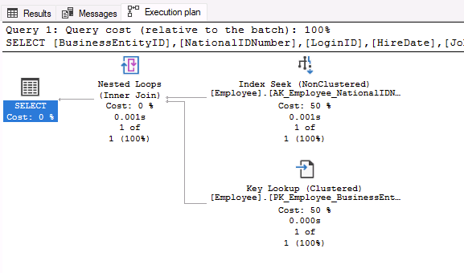

---
lab:
  title: 实验室 9 - 找出数据库设计问题
  module: Optimize query performance in Azure SQL
---

# 找出数据库设计问题

预计用时：15 分钟

学生将获取从课程中获得的信息，以确定 AdventureWorks 中数字转换项目的可交付成果。 通过检查 Azure 门户以及其他工具，学生将确定如何利用本机工具来识别和解决与性能相关的问题。 最后，学生将能够评估数据库设计中的规范化、数据类型选择和索引设计问题。

你是数据库管理员，需识别与性能相关的问题并提供可行的解决方案来解决发现的所有问题。 十多年来，AdventureWorks 一直将自行车和自行车零件直接销售给最终用户和分销商。 你的工作是使用本模块中所述的技术来确定查询性能方面的问题并解决问题。

注意：这些练习要求你复制并粘贴 T-SQL 代码。 在执行代码之前，请验证代码是否已正确复制。

## 还原数据库

1. 将 https://github.com/MicrosoftLearning/dp-300-database-administrator/blob/master/Instructions/Templates/AdventureWorks2017.bak 中的数据库备份文件下载到实验室虚拟机上的 C:\LabFiles\Monitor and optimize 路径（如果文件夹结构不存在，请进行创建）。

    

1. 选择 Windows 开始按钮，然后键入 SSMS。 从列表中选择“Microsoft SQL Server Management Studio 18”。  

    

1. 当 SSMS 打开时，请注意，“连接到服务器”对话框将使用默认实例名称预填充。 选择“连接”  。

    

1. 选择“数据库”文件夹，然后选择“新建查询” 。

    

1. 在“新建查询”窗口中，将以下 T-SQL 复制并粘贴到其中。 执行查询以还原数据库。

    ```sql
    RESTORE DATABASE AdventureWorks2017
    FROM DISK = 'C:\LabFiles\Monitor and optimize\AdventureWorks2017.bak'
    WITH RECOVERY,
          MOVE 'AdventureWorks2017' 
            TO 'C:\LabFiles\Monitor and optimize\AdventureWorks2017.mdf',
          MOVE 'AdventureWorks2017_log'
            TO 'C:\LabFiles\Monitor and optimize\AdventureWorks2017_log.ldf';
    ```

    注意：数据库备份文件名和路径应与在步骤 1 中下载的内容匹配，否则命令将失败。

1. 还原完成后，应会看到一条成功消息。

    

## 检查查询并确定问题

1. 选择“新建查询”  。 复制下面的 T-SQL 代码并将其粘贴到“查询”窗口中。 选择“执行”以执行此查询。

    ```sql
    USE AdventureWorks2017
    GO
    
    SELECT BusinessEntityID, NationalIDNumber, LoginID, HireDate, JobTitle
    FROM HumanResources.Employee
    WHERE NationalIDNumber = 14417807;
    ```

1. 在运行查询之前，选择“包括实际执行计划”图标（如下所示），或者按 Ctrl+M 。 这会在你执行查询时显示执行计划。 选择“执行”以执行查询。

    

1. 在结果面板中选择“执行计划”选项卡，导航到执行计划。 在执行计划中，将鼠标悬停在 `SELECT` 运算符上。 你会看到一条警告消息，该消息由黄色三角形中的惊叹号标识，如下所示。 确定警告消息要告诉你的内容。

    

## 确定解决警告信息的方法

[HumanResources].[Employee] 表结构如以下数据定义语言 (DDL) 语句所示。 查看上一个 SQL 查询中对此 DDL 使用的字段，注意它们的类型。

```sql
CREATE TABLE [HumanResources].[Employee](
     [BusinessEntityID] [int] NOT NULL,
     [NationalIDNumber] [nvarchar](15) NOT NULL,
     [LoginID] [nvarchar](256) NOT NULL,
     [OrganizationNode] [hierarchyid] NULL,
     [OrganizationLevel] AS ([OrganizationNode].[GetLevel]()),
     [JobTitle] [nvarchar](50) NOT NULL,
     [BirthDate] [date] NOT NULL,
     [MaritalStatus] [nchar](1) NOT NULL,
     [Gender] [nchar](1) NOT NULL,
     [HireDate] [date] NOT NULL,
     [SalariedFlag] [dbo].[Flag] NOT NULL,
     [VacationHours] [smallint] NOT NULL,
     [SickLeaveHours] [smallint] NOT NULL,
     [CurrentFlag] [dbo].[Flag] NOT NULL,
     [rowguid] [uniqueidentifier] ROWGUIDCOL NOT NULL,
     [ModifiedDate] [datetime] NOT NULL
) ON [PRIMARY]
```

1. 根据执行计划中显示的警告消息，会建议进行哪些更改？

    1. 确定引起隐式转换的字段和原因。 
    1. 如果查看查询：

        ```sql
        SELECT BusinessEntityID, NationalIDNumber, LoginID, HireDate, JobTitle
        FROM HumanResources.Employee
        WHERE NationalIDNumber = 14417807;
        ```

        你会注意到，与 `WHERE` 子句中的 NationalIDNumber 列进行比较的值是作为数字进行比较的，因为 14417807 不在带引号的字符串中。 

        检查表结构后，你会发现 NationalIDNumber 列使用 `NVARCHAR` 数据类型，而不是 `INT` 数据类型。 这种不一致性导致数据库优化器通过创建不理想的计划将数字隐式转换为 `NVARCHAR`，从而对查询性能产生额外的开销。

我们可以实现两种方法来修复隐式转换警告。 我们将在接下来的步骤中逐一调查。

### 更改代码

1. 你将如何更改代码来解决隐式转换？ 更改代码并重新运行查询。

    请记得打开“包含实际的执行计划”(Ctrl+M)（如果尚未打开）。 

    在这种情况下，只需在值的每一侧添加一个引号即可将其从数字更改为字符格式。 使此查询的查询窗口保持打开状态。

    运行更新后的 SQL 查询：

    ```sql
    SELECT BusinessEntityID, NationalIDNumber, LoginID, HireDate, JobTitle
    FROM HumanResources.Employee
    WHERE NationalIDNumber = '14417807';
    ```

    

    注意：警告消息现已消失，并且查询计划已得到改进。 通过更改 `WHERE` 子句，使与 NationalIDNumber 列相比的值与表中的列的数据类型相匹配，优化器可以消除隐式转换。

### 更改数据类型

1. 还可以通过更改表结构来修复隐式转换警告。

    若要尝试修复索引，请将以下查询复制并粘贴到新的查询窗口中，以更改列的数据类型。 尝试执行查询，方法是选择“执行”或按 <kbd>F5</kbd>。

    ```sql
    ALTER TABLE [HumanResources].[Employee] ALTER COLUMN [NationalIDNumber] INT NOT NULL;
    ```

    将 NationalIDNumber 列数据类型更改为 INT 将解决转换问题。 但是，此更改引入了数据管理员需要解决的另一个问题。

    

    NationalIDNumber 列是已存在的非聚集索引的一部分，必须重新生成/重新创建索引才能更改数据类型。 **这可能会导致生产环境中的停机时间延长，从而凸显在设计中选择正确的数据类型的重要性。**

1. 若要解决此问题，请将下面的代码复制并粘贴到查询窗口中，然后通过选择“执行”来执行它。

    ```sql
    USE AdventureWorks2017
    GO
    
    --Dropping the index first
    DROP INDEX [AK_Employee_NationalIDNumber] ON [HumanResources].[Employee]
    GO

    --Changing the column data type to resolve the implicit conversion warning
    ALTER TABLE [HumanResources].[Employee] ALTER COLUMN [NationalIDNumber] INT NOT NULL;
    GO

    --Recreating the index
    CREATE UNIQUE NONCLUSTERED INDEX [AK_Employee_NationalIDNumber] ON [HumanResources].[Employee]( [NationalIDNumber] ASC );
    GO
    ```

1. 或者，可运行以下查询来确认已成功更改数据类型。

    ```sql
    SELECT c.name, t.name
    FROM sys.all_columns c INNER JOIN sys.types t
        ON (c.system_type_id = t.user_type_id)
    WHERE OBJECT_ID('[HumanResources].[Employee]') = c.object_id
        AND c.name = 'NationalIDNumber'
    ```
    
    
    
1. 现在，让我们检查执行计划。 重新运行不带引号的原始查询。

    ```sql
    USE AdventureWorks2017
    GO

    SELECT BusinessEntityID, NationalIDNumber, LoginID, HireDate, JobTitle
    FROM HumanResources.Employee
    WHERE NationalIDNumber = 14417807;
    ```

    

    检查查询计划；请注意，现在可使用整数按 NationalIDNumber 进行筛选，而没有隐式转换警告。 现在，SQL 查询优化器可以生成并执行最理想的计划。

在本练习中，你学习了如何识别由隐式数据类型转换导致的查询问题，还学习了如何解决该问题来改进查询计划。
