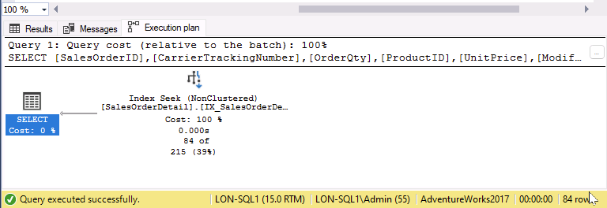

---
lab:
  title: 实验室 10 - 在 SQL 数据库中找出性能不佳的查询中的问题区域
  module: Optimize query performance in Azure SQL
---

# 在 SQL 数据库中找出性能不佳的查询中的问题区域

预计时间：30 分钟

你被聘为高级数据库管理员，以帮助解决当前用户查询 AdventureWorks2017 数据库时遇到的性能问题。 你的工作是使用本模块中所述的技术来确定查询性能方面的问题并解决问题。

你将运行性能欠佳的查询，检查查询计划，并尝试在数据库中进行改进。

注意：这些练习要求你复制并粘贴 T-SQL 代码。 在执行代码之前，请验证代码是否已正确复制。

## 还原数据库

1. 将 https://github.com/MicrosoftLearning/dp-300-database-administrator/blob/master/Instructions/Templates/AdventureWorks2017.bak 中的数据库备份文件下载到实验室虚拟机上的 C:\LabFiles\Monitor and optimize 路径（如果文件夹结构不存在，请进行创建）。

    

1. 选择 Windows 开始按钮，然后键入 SSMS。 从列表中选择“Microsoft SQL Server Management Studio 18”。  

    

1. 当 SSMS 打开时，请注意，“连接到服务器”对话框将使用默认实例名称预填充。 选择“连接”  。

    

1. 选择“数据库”文件夹，然后选择“新建查询” 。

    

1. 在“新建查询”窗口中，将以下 T-SQL 复制并粘贴到其中。 执行查询以还原数据库。

    ```sql
    RESTORE DATABASE AdventureWorks2017
    FROM DISK = 'C:\LabFiles\Monitor and optimize\AdventureWorks2017.bak'
    WITH RECOVERY,
          MOVE 'AdventureWorks2017' 
            TO 'C:\LabFiles\Monitor and optimize\AdventureWorks2017.mdf',
          MOVE 'AdventureWorks2017_log'
            TO 'C:\LabFiles\Monitor and optimize\AdventureWorks2017_log.ldf';
    ```

    注意：数据库备份文件名和路径应与在步骤 1 中下载的内容匹配，否则命令将失败。

1. 还原完成后，应会看到一条成功消息。

    

## 生成实际执行计划

可以通过若干方式在 SQL Server Management Studio 中生成执行计划。

1. 选择“新建查询”  。 复制下面的 T-SQL 代码并将其粘贴到“查询”窗口中。 选择“执行”以执行此查询。

    注意：使用“SHOWPLAN_ALL”可以在结果窗格中查看查询的执行计划的文本版本，而不是在单独的选项卡中以图形方式查看 。

    ```sql
    USE AdventureWorks2017;
    GO

    SET SHOWPLAN_ALL ON;
    GO

    SELECT BusinessEntityID
    FROM HumanResources.Employee
    WHERE NationalIDNumber = '14417807';
    GO

    SET SHOWPLAN_ALL OFF;
    GO
    ```

    你将看到执行计划的文本版本，而不是 SELECT 语句的实际查询结果。

    

1. 请花点时间检查 StmtText 列第二行中的文本：

    ```console
    |--Index Seek(OBJECT:([AdventureWorks2017].[HumanResources].[Employee].[AK_Employee_NationalIDNumber]), SEEK:([AdventureWorks2017].[HumanResources].[Employee].[NationalIDNumber]=CONVERT_IMPLICIT(nvarchar(4000),[@1],0)) ORDERED FORWARD)
    ```

    以上文本说明了执行计划对 AK_Employee_NationalIDNumber 键使用索引查找 。 它还显示执行 CONVERT_IMPLICIT 步骤所需的执行计划。

    查询优化器能够找到适当的索引来提取所需的记录。

## 解决次优查询计划

1. 将下面的代码复制并粘贴到新的查询窗口中。

    在运行查询前，选择“包括实际执行计划”图标（如下所示）或按 <kbd>CTRL</kbd>****<kbd>M</kbd>。 执行查询，方法是选择“执行”或按 <kbd>F5</kbd>。 记下“消息”选项卡中的执行计划和逻辑读取次数。

    ```sql
    SET STATISTICS IO, TIME ON;

    SELECT [SalesOrderID] ,[CarrierTrackingNumber] ,[OrderQty] ,[ProductID], [UnitPrice] ,[ModifiedDate]
    FROM [AdventureWorks2017].[Sales].[SalesOrderDetail]
    WHERE [ModifiedDate] > '2012/01/01' AND [ProductID] = 772;
    ```

    

    查看执行计划时，会注意到有一个键查找。 如果将鼠标指针悬停在该图标上，则会看到属性指示为查询所检索的每一行执行该操作。 可以看到执行计划正在执行键查找操作。

    

    记下“输出列表”部分中的列。 如何改进此查询？

    若要确定需要更改的索引以删除键查找，需要检查其上方的索引查找。 将鼠标悬停在 index seek 运算符上，将出现运算符的属性。

    

1. 可以通过添加包含在查询中返回或搜索的所有字段的覆盖索引来移除键查找。 在此示例中，索引只使用 ProductID 列。 修复键查找并重新运行查询以查看新计划。

    ```sql
    CREATE NONCLUSTERED INDEX [IX_SalesOrderDetail_ProductID] ON [Sales].[SalesOrderDetail]
    ([ProductID] ASC)
    ```

    如果将输出列表字段作为包含列添加到索引中，则将移除键查找 。 由于索引已经存在，因此必须删除并重新创建该索引，或者设置 DROP_EXISTING=ON，以便添加这些列。 请注意，ProductID 列已是索引的一部分，不需要添加为包含列。 我们还可以通过添加 ModifiedDate 来提高索引的性能。

    ```sql
    CREATE NONCLUSTERED INDEX [IX_SalesOrderDetail_ProductID]
    ON [Sales].[SalesOrderDetail] ([ProductID],[ModifiedDate])
    INCLUDE ([CarrierTrackingNumber],[OrderQty],[UnitPrice])
    WITH (DROP_EXISTING = on);
    GO
    ```

1. 重新运行步骤 1 中的查询。 请记下对逻辑读取次数的更改和执行计划更改。 现在，计划只需使用我们创建的非聚集索引。

    

## 使用查询存储来检测和处理回归

接下来，将运行一个工作负载，以生成查询存储的查询统计信息，检查“资源消耗量最大的几个查询”报表，以确定性能不佳问题，并了解如何强制实施更好的执行计划。

1. 选择“新建查询”  。 复制下面的 T-SQL 代码并将其粘贴到“查询”窗口中。 选择“执行”以执行此查询。

    此脚本将为 AdventureWorks2017 数据库启用查询存储功能，并将数据库设置为兼容性级别 100。

    ```sql
    USE [master];
    GO

    ALTER DATABASE [AdventureWorks2017] SET QUERY_STORE = ON;
    GO

    ALTER DATABASE [AdventureWorks2017] SET QUERY_STORE (OPERATION_MODE = READ_WRITE);
    GO

    ALTER DATABASE [AdventureWorks2017] SET COMPATIBILITY_LEVEL = 100;
    GO
    ```

    更改兼容性级别类似于过去移动数据库。 它将 SQL Server 可以使用的功能限制为 SQL Server 2008 中提供的功能。

1. 将 https://github.com/MicrosoftLearning/dp-300-database-administrator/blob/master/Instructions/Templates/CreateRandomWorkloadGenerator.sql 中的 T-SQL 脚本下载到实验室虚拟机上的 C:\LabFiles\Monitor and optimize 路径。

1. 将 https://github.com/MicrosoftLearning/dp-300-database-administrator/blob/master/Instructions/Templates/ExecuteRandomWorkload.sql 中的 T-SQL 脚本下载到实验室虚拟机上的 C:\LabFiles\Monitor and optimize 路径。

1. 在 SQL Server Management Studio 中选择“文件”****“打开”****“文件”菜单。

1. 导航到 C:\LabFiles\Monitor and optimize\CreateRandomWorkloadGenerator.sql 文件。

1. 打开 SQL Server Management Studio 后，选择“执行”或按 <kbd>F5</kbd> 以执行查询。

1. 在新的查询编辑器中，打开文件 C:\LabFiles\Monitor and optimize\ExecuteRandomWorkload.sql，然后选择“执行”或按 <kbd>F5</kbd> 来执行查询。

1. 执行完成后，再次运行该脚本以在服务器上创建额外负载。 对于此查询，使“查询”选项卡保持打开状态。

1. 将下面的代码复制并粘贴到新的查询窗口中，并通过选择“执行”或按 <kbd>F5</kbd> 来执行它。 

    此脚本将数据库兼容性模式更改为 SQL Server 2019 (150)。 自 SQL Server 2008 以来的所有功能和改进现在都可用于数据库。

    ```sql
    USE [master];
    GO

    ALTER DATABASE [AdventureWorks2017] SET COMPATIBILITY_LEVEL = 150;
    GO
    ```

1. 从 ExecuteRandomWorkload.sql 文件导航回到查询选项卡，然后重新执行它。

## 查看“资源消耗量最大的几个查询报表”

1. 若要查看“查询存储”节点，需要刷新 SQL Server Management Studio 中的 AdventureWorks2017 数据库。 右键单击数据库名称，然后选择“刷新”。 然后，你将看到数据库下的“查询存储”节点。

    

1. 展开“查询存储”节点以查看所有可用的报表。 选择“资源消耗量最大的几个查询”报表。

    

1. 报表将打开，如下所示。 在右侧选择菜单下拉列表，然后选择“配置”。

    

1. 在配置屏幕中，将最小查询计划数的筛选器更改为 2。 然后选择“确定”。

    

1. 选择持续时间最长的查询，方法是在报表左上方的条形图中选择最左侧的条形。

    

    这将显示查询存储中最长持续时间的查询及其计划摘要。

## 强制执行更好的执行计划

1. 导航到报表的“计划摘要”部分，如下所示。 你会注意到，两个执行计划的持续时间大不相同。

    

1. 在报表的右上方窗口中，选择持续时间最短的计划 ID（由图表 Y 轴的较低位置表示）。 在上图中，它是 PlanID 43。 选择“计划摘要”图表旁边的计划 ID（应将其突出显示，如上面的屏幕截图所示）。

1. 在摘要图表下选择“强制执行计划”。 此时会弹出一个确认窗口，选择“是”。

    

    强制执行计划后，你会看到“强制执行计划”现在为灰显，计划摘要窗口中的计划现在具有一个复选标记，指示已强制执行。

    有时，查询优化器可能会对要使用的执行计划做出不当选择。 如果出现这种情况，可以强制 SQL Server 使用所需的计划，使其更好地执行。

## 使用查询提示影响性能

接下来，你将运行工作负载，将查询更改为使用参数，并将查询提示应用于查询，然后重新执行查询。

在继续练习之前，通过选择“窗口”菜单关闭所有当前查询窗口，然后选择“关闭所有文档”。 在弹出窗口中，选择“否”。

1. 在运行查询之前，选择“新建查询”，然后选择“包括实际执行计划”图标，或者使用 <kbd>CTRL</kbd>+<kbd>M</kbd>。

    

1. 执行以下查询。 请注意，执行计划显示 index seek 运算符。

    ```sql
    USE AdventureWorks2017;
    GO

    SELECT SalesOrderId, OrderDate
    FROM Sales.SalesOrderHeader
    WHERE SalesPersonID=288;
    ```

    

1. 在“新建查询”窗口中，运行下一个查询。 比较这两个执行计划。

    ```sql
    USE AdventureWorks2017;
    GO

    SELECT SalesOrderId, OrderDate
    FROM Sales.SalesOrderHeader
    WHERE SalesPersonID=277;
    ```

    这次的唯一更改是将 SalesPersonID 值设置为277。 请注意执行计划中的聚集索引扫描操作。

    

如我们所见，根据索引统计信息，由于 `WHERE` 子句中的值不同，查询优化器选择了不同的执行计划。

如果我们只更改 SalesPersonID 值，为什么我们会有不同的计划？

此查询在其 `WHERE` 子句中使用常数，所以优化器会将每个查询视为唯一，并每次生成不同的执行计划。

## 更改查询以使用变量并使用查询提示

1. 更改查询以使用 SalesPersonID 的变量值。

1. 使用 T-SQL DECLARE 语句声明 <strong>@SalesPersonID</strong>，以便在 WHERE 子句中传递值，而不是对值进行硬编码。 应确保变量的数据类型与目标表中列的数据类型相匹配，以避免隐式转换。

    ```sql
    USE AdventureWorks2017;
    GO

    SET STATISTICS IO, TIME ON;

    DECLARE @SalesPersonID INT;

    SELECT @SalesPersonID = 288;

    SELECT SalesOrderId, OrderDate
    FROM Sales.SalesOrderHeader
    WHERE SalesPersonID= @SalesPersonID;
    ```

    如果检查执行计划，则会注意到它使用索引扫描来获取结果。 查询优化器无法进行良好的优化，因为在运行时之前，它无法知道本地变量的值。

1. 可以通过提供查询提示来帮助查询优化器做出更好的选择。 使用 `OPTION (RECOMPILE)` 重新运行上述查询：

    ```sql
    USE AdventureWorks2017
    GO

    SET STATISTICS IO, TIME ON;

    DECLARE @SalesPersonID INT;

    SELECT @SalesPersonID = 288;

    SELECT SalesOrderId, OrderDate
    FROM Sales.SalesOrderHeader
    WHERE SalesPersonID= @SalesPersonID
    OPTION (RECOMPILE);
    ```

    请注意，查询优化器已经能够选择更高效的执行计划。 `RECOMPILE` 选项导致查询编译器将变量替换为其值。

    比较统计信息，可以在“消息”选项卡中看到，对于不包含查询提示的查询，逻辑读取次数之间的差异要大 68%（689 对比 409）。

在本练习中，你学习了如何识别查询问题，还学习了如何解决它来改进查询计划。
