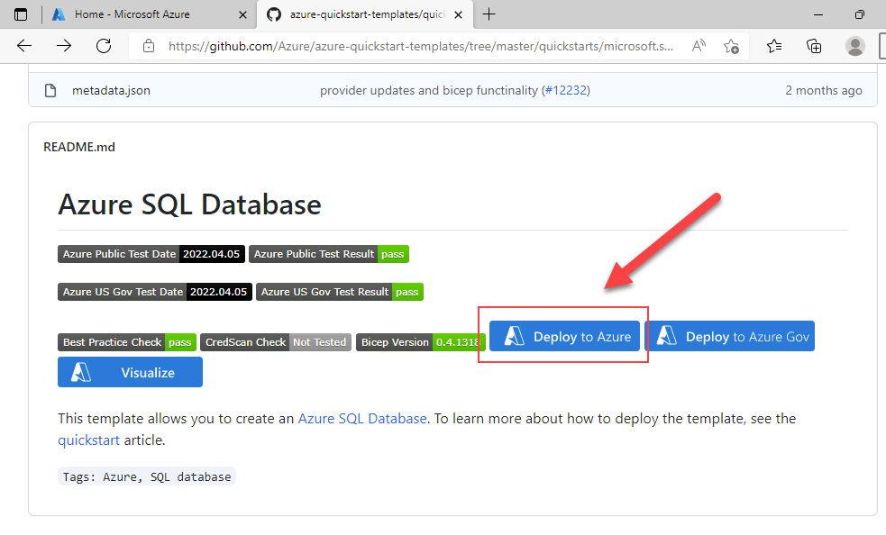

---
lab:
  title: 实验室 11 - 使用 Azure 资源管理器模板部署 Azure SQL 数据库
  module: Automate database tasks for Azure SQL
---

# <a name="deploy-an-azure-sql-database-from-a-template"></a>通过模板部署 Azure SQL 数据库

预计用时：15 分钟

你已被聘用为高级数据工程师，帮助自动执行数据库管理的日常操作。 此自动化旨在帮助确保 AdventureWorks 数据库持续以峰值性能运行，并提供基于特定条件发出警报的方法。 AdventureWorks 在基础结构即服务 (IaaS) 和平台即服务 (PaaS) 产品/服务中都使用 SQL Server。

## <a name="explore-azure-resource-manager-template"></a>浏览 Azure 资源管理器模板

1. 在 Microsoft Edge 中，打开一个新选项卡并导航到 GitHub 存储库中的以下路径，其中包含用于部署 SQL 数据库资源的 ARM 模板

    ```
    https://github.com/Azure/azure-quickstart-templates/tree/master/quickstarts/microsoft.sql/sql-database
    ```

1. 右键单击“azuredeploy.json”，然后选择“在新的标签页中打开链接”来查看 ARM 模板，该模板应如下所示： 

    ```JSON
    {
    "$schema": "https://schema.management.azure.com/schemas/2019-04-01/deploymentTemplate.json#",
    "contentVersion": "1.0.0.0",
    "parameters": {
        "serverName": {
        "type": "string",
        "defaultValue": "[uniqueString('sql', resourceGroup().id)]",
        "metadata": {
            "description": "The name of the SQL logical server."
        }
        },
        "sqlDBName": {
        "type": "string",
        "defaultValue": "SampleDB",
        "metadata": {
            "description": "The name of the SQL Database."
        }
        },
        "location": {
        "type": "string",
        "defaultValue": "[resourceGroup().location]",
        "metadata": {
            "description": "Location for all resources."
        }
        },
        "administratorLogin": {
        "type": "string",
        "metadata": {
            "description": "The administrator username of the SQL logical server."
        }
        },
        "administratorLoginPassword": {
        "type": "securestring",
        "metadata": {
            "description": "The administrator password of the SQL logical server."
        }
        }
    },
    "variables": {},
    "resources": [
        {
        "type": "Microsoft.Sql/servers",
        "apiVersion": "2020-02-02-preview",
        "name": "[parameters('serverName')]",
        "location": "[parameters('location')]",
        "properties": {
            "administratorLogin": "[parameters('administratorLogin')]",
            "administratorLoginPassword": "[parameters('administratorLoginPassword')]"
        },
        "resources": [
            {
            "type": "databases",
            "apiVersion": "2020-08-01-preview",
            "name": "[parameters('sqlDBName')]",
            "location": "[parameters('location')]",
            "sku": {
                "name": "Standard",
                "tier": "Standard"
            },
            "dependsOn": [
                "[resourceId('Microsoft.Sql/servers', concat(parameters('serverName')))]"
            ]
            }
        ]
        }
    ]
    }
    ```

1. 查看并观察 JSON 属性。

1. 关闭“azuredeploy.json”选项卡，并返回到包含“sql-database”GitHub 文件夹的选项卡。 向下滚动并选择“部署到 Azure”。

    

1. Azure 门户将打开“创建 SQL Server 和数据库”快速启动模板页，其中部分资源详细信息填充自 ARM 模板。 使用以下信息填写空白字段：

    - 资源组：以 contoso-rg 开头
    - Sql 管理员登录名：labadmin
    - Sql 管理员登录密码：&lt;输入强密码&gt;

1. 选择“查看 + 创建”，然后选择“创建”。 部署大约需要 5 分钟。

    

1. 部署完成后，选择“转到资源组”。 你将转到 Azure 资源组，其中包含由部署创建的随机命名的 SQL Server 资源。

    

你刚才了解了如何只需单击一下 Azure 资源管理器模板链接就能轻松创建 Azure SQL Server 和数据库。
