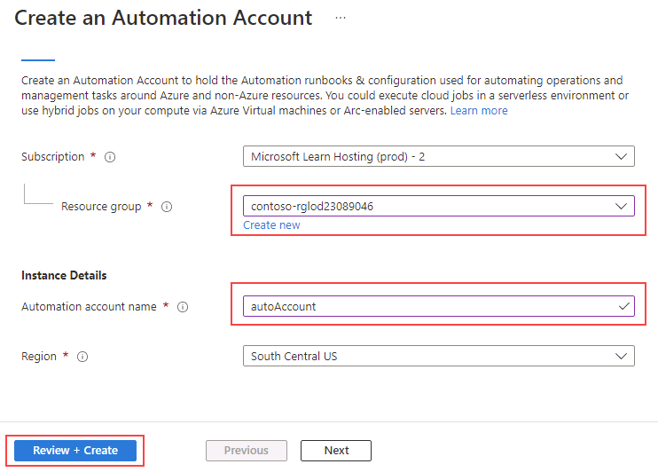
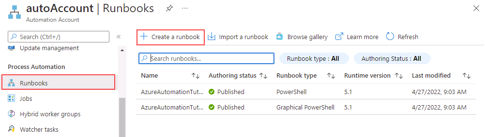

---
lab:
  title: 实验室 13 - 部署自动化 Runbook 来自动重新生成索引
  module: Automate database tasks for Azure SQL
---

# <a name="deploy-an-automation-runbook-to-automatically-rebuild-indexes"></a>部署自动化 Runbook 来自动重新生成索引

预计时间：30 分钟

你已被聘用为高级数据库管理员，帮助自动执行数据库管理的日常操作。 此自动化旨在帮助确保 AdventureWorks 数据库持续以峰值性能运行，并提供基于特定条件发出警报的方法。 AdventureWorks 在基础结构即服务 (IaaS) 和平台即服务 (PaaS) 产品/服务中都使用 SQL Server。

## <a name="create-an-automation-account"></a>创建 Automation 帐户

1. 在实验室虚拟机中，启动浏览器会话并导航到 [https://portal.azure.com](https://portal.azure.com/)。 使用此实验室虚拟机的“资源”选项卡上提供的 Azure 用户名和密码连接到门户。  

    

1. 在 Azure 门户的搜索栏中键入“自动化”，然后在搜索结果中选择“自动化帐户”，再选择“+ 创建” 。

    

1. 在“创建自动化帐户”页上，输入以下信息，然后选择“查看 + 创建” 。

    - **资源组：** 从 automateLab 开头
    - **名称：** autoAccount
    - **位置：** 使用默认值。

    

1. 在“查看”页上，选择“创建”。

    

    > [!NOTE]
    > 自动化帐户应在三分钟内创建完成。

## <a name="connect-to-an-existing-azure-sql-database"></a>连接到现有 Azure SQL 数据库

1. 在 Azure 门户中，通过搜索“sql 数据库”导航到你的数据库。

    

1. 选择 SQL 数据库 AdventureWorksLT。

    

1. 在 SQL 数据库页的主部分，选择“查询编辑器(预览版)”。

    

1. 系统将提示输入凭据以登录到数据库。 使用此凭据：

    - **登录名：** sqladmin
    - **密码：** P@ssw0rd01

1. 会收到以下错误信息：

    

1. 选择上面显示的错误消息末尾提供的“允许列表 IP...”链接。 这会自动添加客户端 IP 作为 SQL 数据库的防火墙规则条目。

    

1. 返回到查询编辑器，然后选择“确定”以登录到数据库。

1. 在浏览器中打开新的标签页，然后导航到 GitHub 页以访问 [AdaptativeIndexDefragmentation](https://github.com/microsoft/tigertoolbox/blob/master/AdaptiveIndexDefrag/usp_AdaptiveIndexDefrag.sql) 脚本。 然后，选择“原始”。

    

    这将以可以复制的格式提供代码。 选择所有文本 (<kbd>CTRL</kbd> + <kbd>A</kbd>)，然后将其复制到剪贴板 (<kbd>CTRL</kbd> + <kbd>C</kbd>)。

    >[!NOTE]
    > 此脚本的目的是对一个或多个索引执行智能碎片整理，以及对一个或多个数据库执行所需的统计信息更新。

1. 关闭 GitHub 浏览器选项卡并返回到 Azure 门户。

1. 将复制的文本粘贴到“查询 1”窗格。

    

1. 删除查询第 5 行和第 6 行的 `USE msdb` 和 `GO`（在屏幕截图中突出显示），然后选择“运行”。

1. 展开“存储过程”文件夹，查看创建的内容。

    

## <a name="configure-automation-account-assets"></a>配置自动化帐户资产

后续步骤包括配置准备创建 Runbook 所需的资产。 然后选择自动化帐户。

1. 在 Azure 门户顶部的搜索框中，键入“自动化”。

    

1. 选择已创建的自动化帐户。

    

1. 在“自动化”边栏选项卡的“共享资源”部分，选择“模块”。  然后选择“浏览库”。

    

1. 在库中搜索 sqlserver。

    

1. 选择“SqlServer”，这将定向到下一个屏幕，然后选中“选择”。 

    

1. 在“添加模块”页面上，选择可用的最新运行时版本，然后选择“导入” 。 这会将 PowerShell 模块导入自动化帐户。

    

1. 需要创建凭据以安全登录到数据库。 导航到自动化帐户边栏选项卡的“共享资源”部分，然后选择“凭据”。

    

1. 选择“+ 添加凭据”，输入以下信息，然后选择“创建” 。

    - 名称：SQLUser
    - 用户名：sqladmin
    - 密码：P@ssw0rd01
    - 确认密码：P@ssw0rd01

    

## <a name="create-a-powershell-runbook"></a>创建 PowerShell Runbook

1. 在 Azure 门户中，通过搜索“sql 数据库”导航到你的数据库。

    

1. 选择 SQL 数据库 AdventureWorksLT。

    

1. 在概述页面上，复制 Azure SQL 数据库的服务器名称，如下所示（服务器名称应以 dp300-lab 开头）。  将在后续步骤中粘贴此名称。

    

1. 在 Azure 门户顶部的搜索框中，键入“自动化”。

    

1. 选择已创建的自动化帐户。

    

1. 滚动到自动化帐户边栏选项卡的“流程自动化”部分，选择“Runbook”，然后选择“+ 创建 Runbook”。  

    

    >[!NOTE]
    > 请注意，现在已创建两个 Runbook。 这些是在自动化帐户部署期间自动创建的。

1. 输入 Runbook 名称 IndexMaintenance 和 Runbook 类型 PowerShell。 选择可用的最新运行时版本，然后选择“创建”。

    

1. 创建 Runbook 后，将下面的 Powershell 代码片段复制并粘贴到 Runbook 编辑器中。 在脚本的第一行上，粘贴在上述步骤中复制的服务器名称。 选择“保存”，然后选择“发布”。

    注意：在保存 Runbook 之前，请验证代码是否已正确复制。

    ```powershell
    $AzureSQLServerName = ''
    $DatabaseName = 'AdventureWorksLT'
    
    $Cred = Get-AutomationPSCredential -Name "SQLUser"
    $SQLOutput = $(Invoke-Sqlcmd -ServerInstance $AzureSQLServerName -UserName $Cred.UserName -Password $Cred.GetNetworkCredential().Password -Database $DatabaseName -Query "EXEC dbo.usp_AdaptiveIndexDefrag" -Verbose) 4>&1

    Write-Output $SQLOutput
    ```

    

1. 如果一切顺利，应会收到一条成功消息。

    

## <a name="create-a-schedule-for-a-runbook"></a>为 Runbook 创建计划

接下来将安排定期执行 Runbook。

1. 在“资源”下，在 IndexMaintenance Runbook 的左侧导航栏中，选择“计划”  。 然后选择“+ 添加计划”。

    

1. 选择“将计划链接到 Runbook”。****

    

1. 选择“+ 添加计划”。

    

1. 提供描述性计划名称和说明（如果需要）。

1. 指定以下日期的开始时间为凌晨 4:00，时区为太平洋时间时区 。 配置为每 1 天重复一次。 不设置过期时间。

    

1. 选择“创建”，然后选择“确定”。

1. 计划现已创建并链接到 Runbook。 选择“确定”。

    

Azure 自动化提供基于云的自动化，还提供配置服务来支持 Azure 环境和非 Azure 环境之间的一致管理。

完成本练习后，你已经自动对 SQL Server 数据库上的索引进行了碎片整理，使其在每天凌晨 4 点运行。