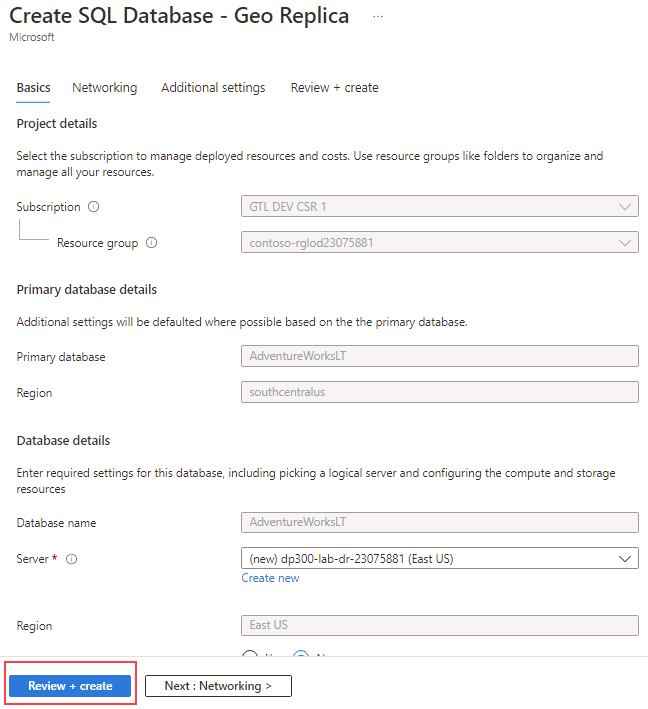

---
lab:
  title: 实验室 14 - 为 Azure SQL 数据库配置异地复制
  module: Plan and implement a high availability and disaster recovery solution
---

# 为 Azure SQL 数据库配置异地复制

预计时间：30 分钟

作为 AdventureWorks 中的数据库管理员 (DBA)，你需要为 Azure SQL 数据库启用异地复制，并确保它正常工作。 此外，你将使用门户手动地将其故障转移到另一个区域。

## 启用异地复制

1. 在实验室虚拟机中，启动浏览器会话并导航到 [https://portal.azure.com](https://portal.azure.com/)。 使用此实验室虚拟机的“资源”选项卡上提供的 Azure 用户名和密码连接到门户。  

    

1. 在 Azure 门户中，通过搜索“sql 数据库”导航到你的数据库。

    

1. 选择 SQL 数据库 AdventureWorksLT。

    

1. 在数据库边栏选项卡的“数据管理”部分，选择“副本” 。

    

1. 选择“+ 创建副本”。

    

1. 在“创建 SQL 数据库 - 异地副本”页的“服务器”下，选择“新建”链接  。

    

    >[!NOTE]
    > 创建新的服务器来托管辅助数据库时，可忽略上面的错误消息。

1. 在“创建 SQL 数据库服务器”页上，输入首选的唯一服务器名称、有效的服务器管理员登录名和安全密码。    选择一个位置作为目标区域，然后选择“确定”以创建服务器。 

    

1. 返回到“创建 SQL 数据库 - 异地副本”页，选择“查看 + 创建”。 

    

1. 选择“创建”  。

    

1. 现在会创建辅助服务器和数据库。 若要检查状态，请在门户顶部的通知图标下查看。 

    

1. 如果成功，则将从“正在进行部署”变为“部署已成功”。

    

## 将 SQL 数据库故障转移到次要区域

创建 Azure SQL 数据库副本后，将执行故障转移。

1. 导航到 SQL Server 页，注意列表中的新服务器。 选择辅助服务器（可能具有不同的服务器名称）。

    

1. 在 SQL Server 边栏选项卡上的“设置”部分，选择“SQL 数据库” 。

    

1. 在 SQL 数据库主边栏选项卡的“数据管理”部分，选择“副本” 。

    

1. 请注意，现已建立异地复制链接。

    

1. 选择辅助服务器的“...”菜单，然后选择“强制故障转移” 。

    

    > [!NOTE]
    > 强制故障转移会将辅助数据库切换到主角色。 在此操作期间，所有会话都会断开连接。

1. 出现警告消息时，单击“是”。

    

1. 主要副本的状态将切换为“挂起”，次要副本的状态将切换为“故障转移” 。 

    

    > [!NOTE]
    > 此过程可能需要几分钟。 完成后，角色将切换，次要副本会成为新的主要副本，旧的主要副本会成为次要副本。

我们看到，可读辅助数据库可能位于与主数据库相同的 Azure 区域中，或者，更常见的是，位于不同的区域。 这种可读辅助数据库也称为异地辅助数据库或异地副本。

现在，你了解了如何为 Azure SQL 数据库启用异地副本，以及如何使用门户手动地将其故障转移到另一个区域。
