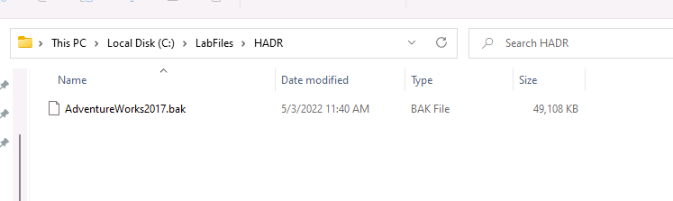
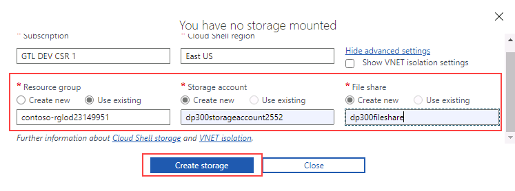
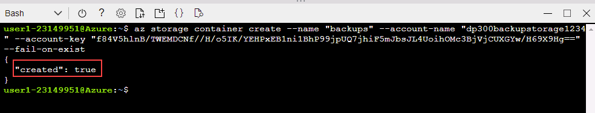
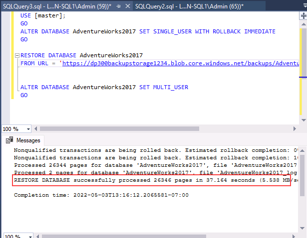

---
lab:
  title: 实验室 15 - 备份到 URL 并从 URL 还原
  module: Plan and implement a high availability and disaster recovery solution
---

# <a name="backup-to-url"></a>备份到 URL

预计时间：30 分钟

作为 AdventureWorks 的数据库管理员 (DBA)，你需要将数据库备份到 Azure 中的 URL，并在发生人为错误后从 Azure Blob 存储还原它。

## <a name="restore-a-database"></a>还原数据库

1. 将 https://github.com/MicrosoftLearning/dp-300-database-administrator/blob/master/Instructions/Templates/AdventureWorks2017.bak 中的数据库备份文件下载到实验室虚拟机上的 C:\LabFiles\HADR 路径（如果文件夹结构不存在，请进行创建） 。

    

1. 选择 Windows 开始按钮，然后键入 SSMS。 从列表中选择“Microsoft SQL Server Management Studio 18”。  

    

1. 当 SSMS 打开时，请注意，“连接到服务器”对话框将使用默认实例名称预填充。 选择“连接”  。

    

1. 选择“数据库”文件夹，然后选择“新建查询” 。

    

1. 在“新建查询”窗口中，将以下 T-SQL 复制并粘贴到其中。 执行查询以还原数据库。

    ```sql
    RESTORE DATABASE AdventureWorks2017
    FROM DISK = 'C:\LabFiles\HADR\AdventureWorks2017.bak'
    WITH RECOVERY,
          MOVE 'AdventureWorks2017' 
            TO 'C:\LabFiles\HADR\AdventureWorks2017.mdf',
          MOVE 'AdventureWorks2017_log'
            TO 'C:\LabFiles\HADR\AdventureWorks2017_log.ldf';
    ```

    注意：数据库备份文件名和路径应与在步骤 1 中下载的内容匹配，否则命令将失败。

1. 还原完成后，应会看到一条成功消息。

    

## <a name="configure-backup-to-url"></a>配置“备份到 URL”

1. 在实验室虚拟机中，启动浏览器会话并导航到 [https://portal.azure.com](https://portal.azure.com/)。 使用此实验室虚拟机的“资源”选项卡上提供的 Azure 用户名和密码连接到门户。  

    

1. 通过选择下图所示的图标，打开“Cloud Shell”提示符。

    

1. 如果你未使用过 Cloud Shell，可能会在门户的下半部分看到一条表示欢迎访问 Azure Cloud Shell 的消息。 选择“Bash”。

    

1. 如果以前未使用过 Cloud Shell，则必须配置存储。 选择“显示高级设置”（可能分配了其他订阅）。

    

1. 使用现有“资源组”，并为“存储帐户”和“文件共享”指定新名称，如以下对话所示。 记下“资源组”的名称。 它应以 contoso-rg 开头。 然后选择“创建存储”。

    注意：存储帐户名必须是唯一的，全部使用小写字母，且不包含任何特殊字符。 请提供唯一名称。

    

1. 完成后，你将看到类似于下图的提示符。 验证 Cloud Shell 屏幕的左上角是否显示“Bash”。

    

1. 通过在 Cloud Shell 中执行以下命令，从 CLI 中创建新存储帐户。 使用前面记下的以 contoso-rg 开头的资源组名称。

    > [!NOTE]
    > 更改资源组名称（-g 参数），并提供唯一的存储帐户名称（-n 参数） 。

    ```bash
    az storage account create -n "dp300backupstorage1234" -g "contoso-rglod23149951" --kind StorageV2 -l eastus2
    ```

    

1. 接下来，获取存储帐户的密钥，你在后续步骤中用到它们。 使用存储帐户和资源组的唯一名称在 Cloud Shell 中执行以下代码。

    ```bash
    az storage account keys list -g contoso-rglod23149951 -n dp300backupstorage1234
    ```

    帐户密钥就在上面的命令的结果中。 请确保使用在上一个命令中使用的名称（位于 -n 之后）和资源组（位于 -g 之后）。 复制“key1”的返回值（不包含双引号），如下所示：

    

1. 将 SQL Server 中的数据库备份到 URL 会使用存储帐户中的容器。 在这一步中，你将为备份存储专门创建一个容器。 为此，请执行以下命令。

    ```bash
    az storage container create --name "backups" --account-name "dp300backupstorage1234" --account-key "storage_key" --fail-on-exist
    ```

    其中，dp300backupstorage1234 是创建存储帐户时使用的唯一存储帐户名称，storage_key 是上面生成的密钥。  输出应返回“true”。

    

1. 若要验证容器备份是否已正确创建，请执行以下代码：

    ```bash
    az storage container list --account-name "dp300backupstorage1234" --account-key "storage_key"
    ```

    其中，dp300backupstorage1234 是创建存储帐户时使用的唯一存储帐户名称，storage_key 是生成的密钥。  应返回与下图相似的输出:

    

1. 为安全起见，需要容器级别的共享访问签名 (SAS)。 这可以通过 Cloud Shell 或 PowerShell 实现。 执行以下代码：

    ```bash
    az storage container generate-sas -n "backups" --account-name "dp300backupstorage1234" --account-key "storage_key" --permissions "rwdl" --expiry "date_in_the_future" -o tsv
    ```

    其中，dp300backupstorage1234 是创建存储帐户时使用的唯一存储帐户名称，storage_key 是生成的密钥，date_in_the_future 是比现在晚的时间。   date_in_the_future 必须为协调世界时 (UTC)。 例如 2021-12-31T00:00Z，它表示在 2020 年 12 月 31 日午夜过期。

    应返回与下图相似的输出。 复制整个共享访问签名，将它粘贴到记事本中，在下一个任务中会用到它。

    

## <a name="create-credential"></a>创建凭据

现在功能已配置，你可以将备份文件生成为 Azure 存储帐户中的 Blob。

1. 启动 SQL Server Management Studio (SSMS)。

1. 系统将提示你连接到 SQL Server。 确保选中“Windows 身份验证”，然后选择“连接” 。

1. 选择“新建查询”  。

1. 使用以下 Transact-SQL 语句创建将用于访问云中的存储的凭据。 填写相应的值，然后选择“执行”。

    ```sql
    IF NOT EXISTS  
    (SELECT * 
        FROM sys.credentials  
        WHERE name = 'https://<storage_account_name>.blob.core.windows.net/backups')  
    BEGIN
        CREATE CREDENTIAL [https://<storage_account_name>.blob.core.windows.net/backups]
        WITH IDENTITY = 'SHARED ACCESS SIGNATURE',
        SECRET = '<key_value>'
    END;
    GO  
    ```

    其中，<storage_account_name> 的两个匹配项都是创建的唯一存储帐户名称，<key_value> 是在上一个任务结束时生成的值，格式如下 ：

    `'se=2020-12-31T00%3A00Z&sp=rwdl&sv=2018-11-09&sr=csig=rnoGlveGql7ILhziyKYUPBq5ltGc/pzqOCNX5rrLdRQ%3D'`

1. 可在对象资源管理器上导航到“安全性”->“凭据”来检查是否已成功创建凭据。

    

1. 如果你键入错误，需要重新创建凭据，你可以通过以下命令将其删除，确保更改存储帐户的名称：

    ```sql
    -- Only run this command if you need to go back and recreate the credential! 
    DROP CREDENTIAL [https://<storage_account_name>.blob.core.windows.net/backups]  
    ```

## <a name="backup-to-url"></a>备份到 URL

1. 通过以下 Transact-SQL 命令将 AdventureWorks2017 数据库备份到 Azure：

    ```sql
    BACKUP DATABASE AdventureWorks2017   
    TO URL = 'https://<storage_account_name>.blob.core.windows.net/backups/AdventureWorks2017.bak';
    GO 
    ```

    其中，<storage_account_name> 是创建和使用的唯一存储帐户名称。 应返回与下图相似的输出。

    

    如果存在配置错误，你将看到一条类似下图的错误消息：

    

    如果发生错误，请检查在凭据创建过程中是否键入了错误的内容，以及所有内容是否已成功创建。

## <a name="validate-the-backup-through-azure-cli"></a>通过 Azure CLI 验证备份

要确保文件确实在 Azure 中，可以使用存储资源管理器（预览版）或 Azure Cloud Shell。

1. 启动浏览器会话并导航到 [https://portal.azure.com](https://portal.azure.com/)。 使用此实验室虚拟机的“资源”选项卡上提供的 Azure 用户名和密码连接到门户。  

1. 使用 Azure Cloud Shell 运行此 Azure CLI 命令：

    ```bash
    az storage blob list -c "backups" --account-name "dp300backupstorage1234" --account-key "storage_key" --output table
    ```

    请确保使用在前面命令中使用的相同的唯一存储帐户名称（在 --account-name 之后）和帐户密钥（在 --account-key 之后） 。

    

    我们可以确认已成功生成备份文件。

## <a name="validate-the-backup-through-storage-explorer"></a>通过存储资源管理器验证备份

1. 若要使用存储资源管理器（预览版），请从 Azure 门户的主页选择“存储帐户”。

    

1. 选择为备份创建的唯一存储帐户名称。

1. 在左侧导航栏中，选择“存储浏览器(预览版)”。 展开“Blob 容器”。

    

1. 选择“备份”。

    

1. 请注意，备份文件存储在容器中。

    

## <a name="restore-from-url"></a>从 URL 还原

此任务将演示如何从 Azure Blob 存储还原数据库。

1. 从 SQL Server Management Studio (SSMS) 中，选择“新建查询”，然后粘贴并执行以下查询 。

    ```sql
    USE AdventureWorks2017;
    GO
    SELECT * FROM Person.Address WHERE AddressId = 1;
    GO
    ```

    

1. 运行此命令更改该客户的名字。

    ```sql
    UPDATE Person.Address
    SET AddressLine1 = 'This is a human error'
    WHERE AddressId = 1;
    GO
    ```

1. 重新运行步骤 1，验证地址是否已更改。 现在请设想，如果有人在没有 WHERE 子句或有错误 WHERE 子句的情况下更改了数千或数百万行。 其中一个解决方案涉及到从上次可用备份还原数据库。

    

1. 若要还原数据库以使其返回到错误更改客户名称之前的位置，请执行以下命令。

    注意：SET SINGLE_USER WITH ROLLBACK IMMEDIATE 语法，打开的事务将全部回滚 。 这可以防止由于活动连接而导致还原失败。

    ```sql
    USE [master]
    GO

    ALTER DATABASE AdventureWorks2017 SET SINGLE_USER WITH ROLLBACK IMMEDIATE
    GO

    RESTORE DATABASE AdventureWorks2017 
    FROM URL = 'https://<storage_account_name>.blob.core.windows.net/backups/AdventureWorks2017.bak'
    GO

    ALTER DATABASE AdventureWorks2017 SET MULTI_USER
    GO
    ```

    其中，<storage_account_name> 是创建的唯一存储帐户名称。

    输出应如下所示：

    

1. 重新运行步骤 1，验证客户名称是否已还原。

    

请务必了解组件和交互，以备份到 Azure Blob 存储服务或从中进行还原。

你现在已看到，你可以在 Azure 中将数据库备份到 URL，并根据需要还原。
